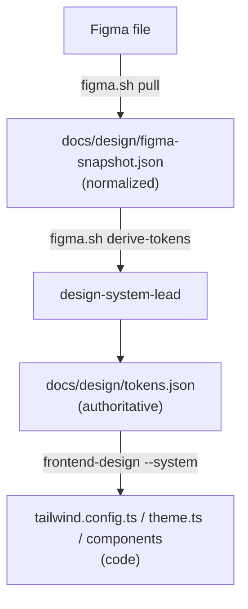

# Design — Figma Adapter (`scripts/figma/`)

**Status:** BUILT (v2.9.0) · **Code:** `scripts/figma/{figma.mjs,figma.sh}`, `scripts/lib/design-tokens.mjs`, `scripts/validators/validate-design-tokens.sh` · **Reference:** `references/figma-adapter.md`

Bring a **real Figma design** into the design pipeline. Figma is to the design
pipeline what the Jira adapter (`scripts/jira/`) is to the ticket pipeline: an
external source consumed via a **normalized snapshot**, with the internal
artifact (`docs/design/tokens.json`, owned by `design-system-lead`) staying
authoritative, and **graceful fallback** to the prose-authored path when no
Figma is configured. Same philosophy as the repo's external-tracker model
(`docs/TRACKER_DATA_MODEL_SCHEMA.md`): we don't become a live client for every
design tool — we pull a normalized export the design agents consume.

## The gap this closes

The design pipeline was prose-only where it should consume a real design.
`design-system-lead` authored `tokens.json` from personas/flows; `frontend-design.md`
declared "the token source of truth is the Figma EXPORT" but **no importer
existed**. This adapter is that importer.

## Flow

One direction only (Figma → tokens.json → code). We never push design back —
matching `frontend-design.md`'s "two-way sync is how tokens fork" rule.

## Adapter (`scripts/figma/figma.mjs`)

- **`pull`** — `GET /v1/files/:key` + `/v1/files/:key/variables/local`, emits
  `figma-snapshot.json`: variables → tokens (`{name,type,value}`, colors as hex),
  the file's `components` map → inventory, top-level `FRAME` nodes → screen
  inventory. Auth is the Figma personal access token via `X-Figma-Token`.
- **`derive-tokens`** — maps the snapshot into `design-system-lead`'s required
  `tokens.json` shape by naming convention (`color/*`, `spacing/*`,
  `color/semantic/*`, `motion/*`). Reports the required keys Figma didn't provide
  so they're authored by hand — `tokens.json` is *derived*, not invented.
- **`doctor`** — config + connectivity.

**Graceful degradation.** No `FIGMA_TOKEN` → the adapter is disabled and
`design-system-lead` authors `tokens.json` from prose exactly as before (purely
additive). The Figma **Variables API needs a paid plan**; on a free plan `pull`
returns zero tokens but still captures components + screens, and `tokens.json`
is authored by hand — never an error.

## Gate — `validate-design-tokens.sh` (offline, skips without a snapshot)

When `figma-snapshot.json` exists: **dropped-token** (a Figma color absent from
`tokens.json` — a design token silently dropped, error), **snapshot-without-tokens**
(pulled but never derived, error), **value-drift** (a color diverged, advisory).
No snapshot → skipped clean, so every non-Figma project is untouched.

## Optional live path — Figma Dev Mode MCP

For a designer actively in Figma, the official **Figma Dev Mode MCP** (select a
frame → structured data + code) can be wired the way `playwright-mcp` is wired —
optional, off by default. The REST adapter above is the portable, in-house,
CI-testable path and the default recommendation; the MCP is an enhancement for
interactive design→code, not a dependency.

## Tests

`scripts/test-figma-adapter.ts` (Pass 42, mocked REST — no live Figma): disabled
fallback, pull extraction, Variables-API 403 degradation, deriveTokens mapping +
missing-key reporting, the drift gate (skip / dropped-token / value-drift), and
the validator both paths.
