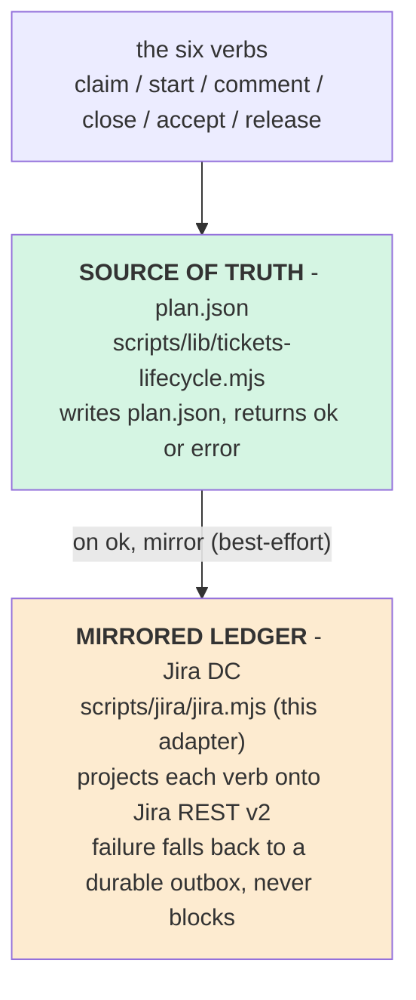

# Design — Jira Adapter (`scripts/jira/`)

**Status:** COMPLETE (v2.7.0) · v2.6.0 shipped the DC adapter + lifecycle mirror; **v2.7.0 completes the program**: convergence keystone (`syncState` — `reconcile` now drains the outbox **and** converges Jira to plan-state, the any-writer catch-all), conductor auto-mirror (unattended path gated on `TRACKER_BACKEND=jira`), **Jira Cloud** backend (`JIRA_FLAVOR=cloud`: v3/ADF/email+token/accountId/parent), and SDLC + install wiring (reflow `sync-plan` step, install.sh setup block). **Delivered:** `scripts/jira/{jira.mjs,jira.sh,jira.config.sample.json}`, `scripts/lib/{lifecycle-outbox,jira-hygiene}.mjs`, `scripts/validators/validate-jira-hygiene.sh`, `scripts/test-jira-adapter.ts` (12 mocked-REST cases), `references/jira-adapter.md`, conductor `mirrorJira()` hook

A canonical adapter that projects this system's **internal ticket lifecycle**
onto a real **Jira Data Center** instance (Cloud is a follow-up behind the same
interface), so that a project can create epics/stories/issues with proper
parent + blocking links in the right components ("user spaces like ui"), and run
the exact same SDLC hygiene — claim, comment, close, maker≠verifier, epic-closes-
only-when-children-done — against Jira. When Jira is absent or unreachable, the
identical methodology runs on `plan.json` alone with **zero behavior change**.

---

## 1. First principle: `plan.json` is source of truth, Jira is a mirrored ledger

This repo already has a code-enforced lifecycle engine — `plan.json`'s
`modules[]` + `scripts/lib/tickets-lifecycle.mjs`, with the six verbs
`claim → start → comment → close → accept → release`, WIP=1, maker≠verifier,
append-only `history[]`, and a `close` gate on manifest + `verify` exit-0
(`docs/TICKET_SCHEMA.md`). **That engine is the methodology.** The Jira adapter
does not replace it and does not become a second source of truth.



**Why plan.json-first, not Jira-first:** the local file write is cheap,
transactional, and always available; a remote Jira call is none of those. Making
local truth authoritative is what lets the fallback be a true no-op and the
outage path be lossless (§6). It also matches the repo's standing decision
(`memory: ticket-tracker-decision-research`) that plan.json stays the contract
layer and the external tracker is the lifecycle/audit ledger.

---

## 2. Form factor (approved)

```
scripts/jira/
  jira.mjs         # Node core: REST v2 client (Bearer PAT), lifecycle→Jira mapping,
                   # idempotent create/link, outbox, reconcile. CLI entrypoint.
  jira.sh          # thin wrapper: `jira.sh <verb> ...` → node jira.mjs <verb> ...
                   #   parity with the jira.sh you use in opencode elsewhere
  jira.test.mjs    # unit tests against a MOCKED REST client (no live Jira in CI)
  jira.config.json # OPTIONAL per-project field/name mapping (committed by a project)
```

Matches the repo's `.mjs` + validator idiom while giving you the `jira.sh` CLI
surface you already use.

---

## 3. Configuration & backend selection (the new seam)

There is no tracker-backend seam in the repo today — this design introduces one,
env-driven so that **absence = fallback**:

| Var | Meaning | Default |
|---|---|---|
| `JIRA_BASE_URL` | e.g. `https://jira.company.com` | unset → adapter disabled |
| `JIRA_TOKEN` | Personal Access Token, sent as `Authorization: Bearer` | — |
| `JIRA_PROJECT` | project key, e.g. `PROJ` | — |
| `JIRA_FLAVOR` | `datacenter` \| `cloud` | `datacenter` |
| `TRACKER_BACKEND` | `auto` \| `jira` \| `none` | `auto` (jira iff `JIRA_BASE_URL` set) |

`jira.config.json` (optional, per project) carries what can't be inferred:

```jsonc
{
  "epicLinkFieldId": "customfield_10014",   // DC "Epic Link" field; else auto-discovered via /field
  "issuetypes": { "epic": "Epic", "story": "Story", "task": "Task" },
  "blocksLinkType": "Blocks",                // inward "is blocked by"
  "statusMap": {                              // plan.json status → Jira transition target
    "ready": "To Do", "claimed": "Selected for Development",
    "in_progress": "In Progress", "in_review": "In Review", "done": "Done"
  },
  "laneToComponent": { "frontend": "ui", "backend": "api", "infra": "platform" }
}
```

Everything has a sane default; a project with only the three env vars works.

---

## 4. The mapping (System A ↔ Jira DC)

| `plan.json` (ModuleTicket) | Jira DC |
|---|---|
| module `id` | issue label `plan-id:<id>` (the idempotency key — JQL lookup before create) |
| module `title` | issue summary |
| grouping / phase | **Epic** issue; child stories carry the Epic Link |
| `depends_on[]` | **"is blocked by"** issue links (this issue ← blocked by each dep) |
| `lane` | **Component** (`laneToComponent`, e.g. `ui`) + label `lane:<lane>` |
| `acceptance[]` | acceptance-criteria checklist in the description |
| `owner` | **assignee** |
| `status` | workflow **transition** (`statusMap`) |
| `history[]` note | Jira **comment** |
| `evidence{branch,commits}` | comment + (optional) remote link |

**"Proper user spaces like ui":** the `lane` partition maps to a Jira
**Component**; `sync-plan` ensures the component exists (or maps via config)
before assigning it. This is how work lands in the right space instead of a
flat dumping ground.

---

## 5. Hierarchy hygiene — "grab issues, not epics; close the epic only when children are done"

The internal board is a flat lane-partitioned DAG (no epic type); Jira has real
epic→story hierarchy. The adapter **owns the hierarchy** and enforces the rule
you asked for:

- `sync-plan` creates the epic scaffold and the child stories/tasks; **epics are
  never claimable.**
- `jira.sh claim <EPIC>` → **refused**: `"<KEY> is an Epic — claim a child issue,
  not the epic."` (mirrors "claimable = ready + unowned" and the intent that
  work is grabbed at the leaf).
- `jira.sh close-epic <EPIC>` → **refused unless every Epic-Link child is Done.**
  This is a *new* concept (plan.json has no epic-closure rule; its closest analog
  is `requirementClosure()` — a story closes only when all its modules are
  `done`). We implement the same shape for Jira epics.
- `jira.sh reconcile` will, per config, auto-transition an epic to Done once its
  last child closes (or leave it for a human — `epicAutoClose: false` default).

---

## 6. Atomicity & graceful degradation (the inherited hard problem)

Two write targets (plan.json + Jira) is exactly the non-atomic dual-write the
repo already flagged as unsolved (`docs/work/LESSONS.md:29`; the conductor's
`pushRemotes()` best-effort loop). We do **not** pretend distributed 2-phase
commit. Instead:

1. **plan.json is written first and is authoritative.** The lifecycle verb
   succeeds or fails on the local file alone — Jira never gates local work.
2. **A backend-agnostic event is emitted to a durable outbox**
   (`docs/work/jira-outbox.jsonl`, append-only JSONL). This emit is the *only*
   touch to the SoT engine (§7) — a **single synchronous `appendOutbox()` call
   at the CLI/orchestration boundary in `scripts/lib/tickets.mjs`, after the verb's
   `savePlan()` succeeds**. It carries **no Jira knowledge, no import of the
   adapter, and no network** — it writes one JSONL line iff a tracker backend is
   configured, else it is a no-op. `tickets-lifecycle.mjs` (the invariant engine)
   is untouched, and its tests do not change.
3. **A drainer applies the outbox to Jira.** Interactive use (`jira.sh <verb>`)
   drains **inline immediately** → real-time mirror when Jira is healthy. When a
   verb was performed by another path (the conductor calling the lifecycle
   functions directly), the event sits pending until `jira.sh reconcile` drains
   it. Either way the drain is the same idempotent code path: create =
   JQL-lookup-then-POST-only-if-absent; transition = no-op if already in target
   status; link = skip if it exists; assign = idempotent PUT. Replay is safe any
   number of times.
4. **`jira.sh reconcile --check` / `jira.sh doctor`** report drift (plan.json vs
   Jira) and pending-outbox depth as a gate signal. `doctor` additionally
   **fetches the live workflow's status names on connect and warns if
   `statusMap` doesn't match the instance** — so a bad transition name fails
   loudly at setup, not silently mid-run.

**Why the emit lives in `tickets.mjs`, not `tickets-lifecycle.mjs`:** the barrel
is the single sanctioned writer and already the orchestration layer; the
invariant engine stays backend-neutral. The outbox is also the seam for any
future backend (Linear, GitHub Projects) — a second drainer, nothing else
changes.

This makes local truth atomic, the remote eventually-consistent, and a Jira
outage a queued-not-lost event — the lossless answer the `pushBoardBothOrThrow`
lesson wanted, without a fake transaction.

**Fallback matrix:**

| Condition | Behavior |
|---|---|
| `JIRA_BASE_URL` unset (`TRACKER_BACKEND=auto→none`) | adapter disabled; verbs run plan.json-only; one-line notice `"[jira] not configured — plan.json is the ledger"`. **Byte-for-byte today's behavior.** |
| Configured but unreachable/5xx/auth-fail | verb still succeeds on plan.json; mirror op queued to outbox; warning printed; drain later via `reconcile`. |
| Configured and healthy | mirror applied inline; outbox stays empty. |

---

## 7. Lifecycle projection (each verb → Jira)

Mirrors run **after** the internal verb returns `{ok:true}`:

| Verb | Jira projection | Guard it adds |
|---|---|---|
| `claim` | assign to actor + transition → `claimed` status | **refuse if the Jira issue is already assigned to a different user** (cross-surface double-grab guard — someone grabbing in the Jira UI is respected) |
| `start` | transition → In Progress | owner-only (inherited) |
| `comment` | add Jira comment | — |
| `close` | transition → In Review + post evidence (branch/commits) comment | inherits manifest + `verify` exit-0 gate before the mirror runs |
| `accept` | transition → Done | **maker≠verifier**: refuse if Jira assignee == acceptor |
| `release` | unassign + transition → To Do | reason required (inherited) |

Because the guards live on the *internal* verb (which runs first), the Jira
mirror can never advance a ticket the internal engine refused.

---

## 8. CLI surface (`jira.sh`)

```
jira.sh sync-plan <plan.json>        # idempotent: create/update epics+stories+links+components
jira.sh claim   <ISSUE> <actor>      # assign+transition; refuses epics; refuses cross-grabbed
jira.sh start   <ISSUE> <actor>
jira.sh comment <ISSUE> <actor> <note>
jira.sh close   <ISSUE> <actor> --branch <b> --commits <c1,..>
jira.sh accept  <ISSUE> <actor>      # maker≠verifier
jira.sh release <ISSUE> <actor> <reason>
jira.sh close-epic <EPIC>            # gated: all Epic-Link children Done
jira.sh reconcile [--check]          # drain outbox / report drift
jira.sh pull > docs/work/tracker-snapshot.json   # normalized export → feeds tracker-model.mjs
jira.sh doctor                       # config + connectivity + drift + outbox depth
```

`pull` emits the **existing** normalized `TrackerItem` snapshot
(`docs/TRACKER_DATA_MODEL_SCHEMA.md`), so `validate-tracker-integrity.sh` and
`tracker-link-sweep.mjs` work unchanged — we populate the abstraction point the
repo already built, we don't reinvent it.

---

## 9. New gate: `validate-jira-hygiene.sh` (active only when `TRACKER_BACKEND=jira`)

Fail-on:
- an Epic whose Epic-Link children are all Done but is itself still Open
  (epic-closes-when-children-done, enforced);
- an issue In Progress with **no assignee** (claim-before-work);
- a `plan.json` module `status: done` whose Jira issue is not Done **and** the
  outbox has no pending op for it (silent drift, not a queued mirror);
- a claimed issue whose Jira assignee ≠ its plan.json `owner` (split-grab).

Wired into the phase gate chain **only when Jira is the backend** (so non-Jira
projects are untouched). Reuses `validate-tracker-integrity.sh` for snapshot
shape.

---

## 10. Cloud (follow-up, interface-ready)

Same interface, backend swap under `JIRA_FLAVOR=cloud`: `/rest/api/3`, ADF
comment bodies, `email + API-token` Basic auth, Cloud parent field instead of
the DC Epic Link custom field. No caller changes.

---

## 11. Test plan (mocked REST — no live Jira in CI)

`jira.test.mjs`:
- idempotent create: second `sync-plan` issues **zero** POSTs (JQL finds existing);
- Epic Link set on child; blocking link created from each `depends_on`;
- `claim` on an epic is refused; `claim` on a cross-assigned issue is refused;
- `accept` refused when assignee == acceptor (maker≠verifier);
- `close-epic` refused while any child is not Done;
- simulated 503 on a mirror → op lands in outbox pending; `reconcile` drains it;
  replaying twice is a no-op;
- `pull` output validates against the `TrackerItem` schema via `tracker-model.mjs`;
- adapter disabled (no `JIRA_BASE_URL`) → verbs succeed, zero REST calls attempted.

---

## 12. Out of scope this pass

- Jira Cloud backend (interface-ready, follow-up).
- Two-way sync *from* Jira → plan.json beyond `pull` (Jira is a ledger, not an
  authority; drift is reported, not auto-applied back).
- Sprint/board management, worklogs, time tracking.

---

## 13. Deliverables & sequencing (post-approval)

1. `scripts/jira/jira.mjs` + `jira.sh` + `jira.config.json` sample.
2. `scripts/jira/jira.test.mjs` (mocked REST) — alongside the code.
3. `scripts/validators/validate-jira-hygiene.sh`.
4. Docs: `references/jira-adapter.md` (setup + verb reference) + catalog entry;
   `docs/TICKET_SCHEMA.md` cross-link.
5. Wire the mirror hooks into `tickets-lifecycle.mjs` behind the backend check
   (no-op when disabled) — smallest possible touch to the SoT engine.
6. Regen attest-claude, dual-remote push, tag, release as **v2.6.0**.
