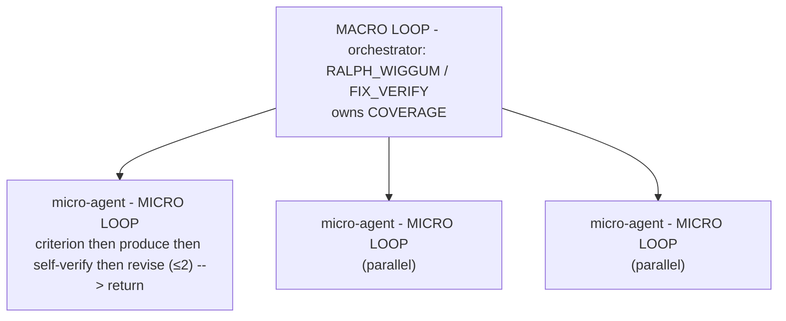

# Loop Engineering Playbook

**Status:** Living document — compiled 2026-06-22, primary sources verified via WebFetch
**Audience:** the expert system (`attest` / `attest-claude`), **Foreman** (the program formerly known as Jarvis), and anyone building autonomous agent loops
**Purpose:** Reconcile how *we* orchestrate agents today (the HANDOFF pattern) with the discipline of **loop engineering** (Addy Osmani, Sabrina Ramonov) and how **Boris Cherny + Cat Wu** (creators of Claude Code) design agentic loops — then turn the gaps into a concrete backlog wired to Foreman.

---

## 0. TL;DR

1. **The "program that automates this and all our experts" already has a name and a spec: Foreman.** Jarvis → **Foreman** (renamed 2026-06-11). VISION: *"an autonomous software foreman: you hand it a goal, and it runs the full expert-driven SDLC — routing work to specialist experts, enforcing objective quality gates, revising failures, committing checkpoints — unattended, pausing only at an approval queue for deploys, main merges, and destructive operations."* Spec lives in `ai-assistant-agent/docs/foreman/` (28 tasks, 8 waves, branch `feat/foreman`). See §7.
2. **The loop-engineering canon validates Foreman's design.** Foreman's locked principles independently match the canon: *budgets are circuit breakers* (Osmani's budget cap), *every human dead-end gets an autonomous policy* (Osmani's escalation requirement), *failures store structured error memories* + distill loop (Cherny's "write the lesson down"), *stuck loops detected by gap checksums not iteration counts* (Osmani's no-progress kill, done better). The independent research and Foreman's own 2026-06-11 review surfaced the **same gaps**.
3. **Capability shift:** opencode now natively **spawns custom subagents** (#20059 CLOSED) but still **has no native loop/goal/scheduler** and still **can't run MCP tools inside subagents** (#16491 OPEN). Meanwhile **Claude Code itself shipped `/loop`, `/schedule`, Routines, and nested subagents (depth 5)** — the reference implementation of everything in this doc. See §1.
4. **The one real delta to add to Foreman:** an **independent evaluator model** (G1) — the model that *made* the artifact must not be the model that *scores* it. Everything else is largely already in the Foreman waves; this doc maps each gap to a wave (§7.2, §9).

---

## 0a. Implementation status (2026-06-22) — adversarially verified

Implemented in the canonical repo, then **independently Challenged** (a fresh verifier agent + evidence checks). The Challenger caught two over-reports — fixed in a second pass. Status below is the post-fix, honest state (88 tests green, `build:claude` in sync):

| Gap | Status | Evidence / landed in |
|---|---|---|
| **G2** no-progress kill | ✅ **DONE — verified real** | `run-coverage-loop.sh` gap-checksum stall (exit 3). Challenger confirmed the checksummed JSON line has no volatile field (the `ts` lives only in the telemetry sink), ordering correct, no iter-1 false positive. |
| **G3** auto-correction | ✅ **DONE — verified real** | `scripts/loop-learn.mjs`, executed live (append-no-clobber confirmed); `--claude` insert now anchored to start-of-line heading after the Challenger's edge-case note. |
| **G1** independent verifier model | ✅ **DONE — fixed after Challenge** | Challenger found it was **doc-only** (nothing wrote the flag). Fixed: `detect-model-context.sh` now emits `maker_model`/`verifier_model`/`verifier_independent` in every path; `MODEL_ADAPTER.md` + GATE_SCORING + FIX_VERIFY reference them. |
| **G7** refuse-to-loop gate | ✅ **DONE — now script-enforced** | new `scripts/validators/validate-loop-readiness.sh` parses the inventory and exits 1 on any row whose Artifact isn't objectively checkable (tested: passes "validate-erd…/p95<200ms/diagram exists", fails "improve the UX"). Wired into the `RALPH_WIGGUM_LOOP.md` refuse-to-loop gate. |
| **Micro-loops wired** | ✅ **DONE** | new `agents/shared/MICRO_LOOP.md` + a load-bearing micro-loop instruction injected into **all 27 micro-agents** (security ×9, code-review ×8, performance ×6, onboard ×4) after their LOOP_PREVENTION line. See §11. |
| **G6** loop-state GC | ✅ **already existed** | `run-coverage-loop.sh:52-61` (Challenge corrected the playbook — never an open gap) |
| **G4** Challenger in onboard | ✅ **already existed** | `sdlc-onboard-mode.md` Step 6b mandatory Challenger Gate on LANDSCAPE + HEALTH_ASSESSMENT (verify pass corrected the playbook — F3 was stale) |
| **G4** coverage in feature/improve | ✅ already wired | `run-coverage-loop.sh` CAP=2 for `feature`/`improve` |
| **EX** #20059 closed | ✅ **DONE** | `EXECUTOR_SELECTION.md` known-issues note |
| **G2** token/$ budget cap | ⏳ Foreman | runtime concern — Foreman "budgets are circuit breakers" W0–W1 |
| **G5** Goal/Routine abstraction | ⏳ Foreman | the Foreman epic itself |

---

## 1. Capability status (June 2026) — opencode vs Claude Code

opencode: **v1.17.9** (2026-06-21, repo moved `sst/` → `github.com/anomalyco/opencode`). Claude Code: native loop tooling shipped.

| Capability | opencode | Claude Code | Implication for us |
|---|---|---|---|
| **Spawn custom subagents** | ✅ Task tool accepts custom agents (#20059 **CLOSED**) | ✅ Task/Agent tool | Drop manual-paste HANDOFF for non-MCP agents on native-Task hosts; Executor A becomes default. |
| **MCP tools inside a spawned subagent** | ❌ **#16491 OPEN** — tools appear but can't execute | ✅ works (deferred-tool loading) | **Keep Executor B (subprocess `opencode run --agent`) / C (manual) for MCP-dependent agents** (researcher→playwright, coding-agent→Context7, memory-mid-task) until #16491 closes. |
| **Recursive / nested subagents** | ❌ #9280 open (one level only) | ✅ **depth 5**, each keeps own context | opencode orchestration stays flat. Foreman (Claude-side) can nest. |
| **Native loop** | ❌ #18001/#18636 OPEN | ✅ **`/loop`** — recurring task up to 3 days, local | Our coverage/fix-verify loops remain mandatory on opencode; Foreman can lean on `/loop` for the Claude path. |
| **Native scheduling / cloud routine** | ❌ #11232 OPEN | ✅ **`/schedule`** + **Routines** (cloud, GitHub-event triggered, laptop-closed) | Use OS cron driving `opencode run` for opencode; Routines for Claude-hosted Foreman jobs. |
| **Composite self-test skill** | — | ✅ **`/go`** = test + simplify + PR; *"test itself end to end using bash, browser, or computer use"* | Adopt as a Foreman runtime-verification pattern (§8). |

**Verdict:** opencode spawn = SUPPORTED (PARTIAL if MCP). opencode loops/scheduling = NOT native (cron/plugins). Claude Code = the full reference stack. **The HANDOFF pattern is now a fallback + MCP bridge; the loop machinery is the core and stays.**

> Memory updated: `memory/opencode-phase6-blocker-status.md` re-checked against v1.17.9 (#20059 closed, #16491 the live blocker).

---

## 2. What "loop engineering" is (Osmani + Ramonov, verified)

**Definition (Osmani, verbatim):** loop engineering is *"replacing yourself as the person who prompts the agent. You design the system that does it instead."* The model becomes a subroutine your program calls. Steinberger: *"You shouldn't be prompting coding agents anymore. You should be designing loops."* Cherny: *"My job is to write loops."*

### 2.1 Osmani's five infrastructure components (+ the sixth)

The pieces you assemble a loop *from* (verbatim from the article):

| Component | Role | Our asset today |
|---|---|---|
| **1. Automations** | discovery + triage on a schedule | cron → `opencode run` / Foreman WorkflowEngine entry |
| **2. Worktrees** | isolate parallel features so agents don't collide | `isolation: worktree`; PARALLEL_WAVE_PROTOCOL |
| **3. Skills** | codify project knowledge in `SKILL.md` | 31 skills |
| **4. Plugins / Connectors** | MCP tools to external systems | our 6 MCPs |
| **5. Sub-agents** | separate agents for *ideation vs. verification* | 70 micro-agents; Challenger |
| **6. External state (the one people forget)** | *"the model forgets everything between runs so the memory has to be on disk"* — markdown or Linear | `docs/work/*.md`, COVERAGE_LOOP files, claude-memory MCP |

**Operational anatomy (complementary framing).** When you *run* a loop, the moving parts are: **Goal → Prompter → Reader → Verifier → Controller → Memory.** We implement all six: inventory/FIX_BACKLOG (Goal), HANDOFF emitter (Prompter), Completion-Manifest + gate runner (Reader), validators/`fix-verify.mjs`/Challenger (Verifier), asymmetric-threshold + 3-iter cap (Controller), disk state (Memory).

### 2.2 Osmani's three hard problems (verbatim) + loopmaxxing

The parts people skip, and the failure mode:

1. **Verification burden stays yours** — *"A loop running unattended is also a loop making mistakes unattended."*
2. **Comprehension debt accelerates** — understanding *"rots"* as the loop ships code you didn't write.
3. **Cognitive surrender risk** — *"tempting to stop having an opinion and just take whatever it gives back."*

- **Loopmaxxing** = using loops *to avoid thinking* rather than to enhance it; *"the same action yields opposite results depending on intent."* Fails on subjective goals with no binary pass/fail (no computable stop → burns budget).
- Closing rule: *"Build the loop. But build it like someone who intends to stay the engineer, not just the person who presses go."*
- **Guardrails (corroborated, bdtechtalks):** every loop needs a max-iteration cap, a **budget cap (tokens/$)**, a success function the agent can evaluate, and an escalation path — plus a **diff/no-progress kill.**

### 2.3 Ramonov — Goal vs Loop vs Routine, and `/goal` (verbatim)

| Term | Definition (verbatim) |
|---|---|
| **Goal** | *"A finish line the AI works toward and can verify independently … It keeps working on its own until it crosses it."* |
| **Loop** | *"designing a small system that prompts an AI on a schedule and against a goal, instead of you typing each prompt."* |
| **Routine** | *"A saved AI job that runs by itself on a schedule, in the cloud, even when your laptop is closed."* |

- **`/goal` syntax:** `/goal <what "done" looks like>`. Mechanism: *"After each round, a small fast AI checks: is the goal met, yes or no? A 'no' and Claude keeps going. A 'yes' and it stops on its own."*
- **Routine template:** plain-language instructions **with an explicit negative guardrail** (*"Do NOT reply to anything"*) → connectors → trigger (Daily @ 9am) → Create.
- **Formula:** *"AI Leverage = Your Skill × Your Clarity"*, where Clarity = your ability to define what "done" looks like.

---

## 3. How Boris Cherny + Cat Wu build agentic loops (verified)

> *"My job is to write loops."* — the interface, per Cherny, *"moved from source code, to agent, to loop or routine."* Three-stage personal evolution: autocomplete → 5–10 parallel hand-prompted sessions → loops that prompt Claude autonomously.

1. **Verification is the #1 tip (verbatim):** *"Give Claude a way to verify its work. If Claude has that feedback loop, it will 2-3x the quality of the final result."*
2. **The evaluator is a *separate* model — and it judges from the transcript.** `/goal` is *"a condition-based loop. You write a measurable end state, like tests passing and lint being clean, and Claude keeps working turn by turn until a separate small model says the condition is met."* Crucial detail: *"the evaluator does not run commands or read files independently, so Claude has to surface evidence in the transcript."* → **Our validators are actually stronger here: they re-run independently.** Keep that; just make the *scorer* a different model from the maker (G1).
3. **"Can the agent run the thing?"** Verification means runtime, not just unit tests. Cat Wu's pattern: a *"desktop development skill that teaches Claude how to run the local desktop app … spins up the app, uses computer use to click around, invokes the new UX, tests edge cases, fixes bugs, and rechecks."* Mirrored in `/go` and `/ui-verify`.
4. **Durable correction (verbatim):** *"Every single time Claude makes a mistake, I don't tell it to do it differently. I tell it to write it to the CLAUDE.md, or make a skill, or something."* Team keeps a shared CLAUDE.md; *"after every correction, end with: 'Update your CLAUDE.md so you don't make that mistake again.'"*
5. **Plan mode = the design doc** — *"Pour your energy into the plan so Claude can 1-shot the implementation."* Nuance: newer big models (4.6/4.7) need it less — but **our small local models still benefit**, so keep plan-first for the local tier.
6. **Permissions:** never blanket-skip; pre-allow safe commands with wildcards (`Bash(bun run *)`, `Edit(/docs/**)`) in a checked-in, team-shared allowlist.
7. **Parallelism via worktrees** — *"the single biggest productivity unlock, and the top tip from the team."*
8. **Subagents = context isolation, not more intelligence** — keep the reads/greps/dead-ends in the child, return only the conclusion; nest to depth 5, *"each layer keeps its own context window."*
9. **Context minimalism + hinted compaction:** *"Tell the model only what it needs to know and let it figure out the rest"* — over-context is micromanaging. `/compact` (lossy) vs `/clear` (hand-written brief for a genuinely new task); lower the auto-compact window (*"context rot kicks in around 300-400k tokens"*).
10. **Claude Code is a Unix utility** — composable like `grep`/`cat`; *"do the simple thing first"*; smallest useful building blocks (memory = a markdown file). ~80–90% of Claude Code is written by Claude.

---

## 4. Our system vs the canon — strengths & gaps

### 4.1 Where we already lead

| Strength | Mechanism | Canon parallel |
|---|---|---|
| Durable state survives context loss | `sdlc-state.md`, `COVERAGE_LOOP_*.md`, ≤1,200-tok packets | Osmani's "sixth element" |
| **Validators re-run independently** | `run-coverage-loop.sh`, `fix-verify.mjs` fingerprint diff | *stronger than* CC's transcript-only `/goal` evaluator |
| Hard 3-iter cap + escalation block | Ralph-Wiggum, Fix-Verify | iteration cap |
| Context isolation by design | 70 micro-agents, ≤4k orchestrator, one-file-per-HANDOFF | subagents-as-context |
| Evidence-only adversarial check | Challenger (cite `file:line`/URL/validator or UNVERIFIABLE; 4-call cap) | ideation-vs-verification split |
| Objective-over-subjective gates | coverage loop default; confidence loop rare | checkable "done" |

### 4.2 Where we lag — the targets

| # | Gap | Canon says | Fix | Foreman status |
|---|---|---|---|---|
| **G1** | **Verifier is often the same model that made the artifact.** | Cherny: makers *"over-report success"* — use a separate evaluator. | Add `MAKER_MODEL`/`VERIFIER_MODEL` to `MODEL_ADAPTER.md`; GateScorer + Fix-Verify run on the verifier instance (a faster tier on .114). | **NOT yet explicit in GateScorer — the one real new delta.** |
| **G2** | Iteration cap but no budget/$ cap or diff-stall kill. | budget = stopping condition; add no-progress kill. | token/$ ceiling + **gap-checksum stall detector** in loop scripts (exit 3 = no-progress halt). | ✅ Designed — *"budgets are circuit breakers" 70/85/100%* + *"stuck loops detected by gap checksums."* |
| **G3** | Mistake→CLAUDE.md correction is manual. | *"write it down, don't re-prompt."* | Auto-append `{symptom, root-cause, rule}` on every escalation. | ✅ Designed — *"failures store structured error memories"* + distill (human-PR-gated). |
| **G4** | feature/improve have no coverage loop; onboard has no Challenger. | every loop needs a verifier. | extend coverage loop + Challenger into those modes. | Process review W2–W4. |
| **G5** | No first-class Goal/Routine abstraction. | Ramonov Goal vs Routine. | GOAL contract + ROUTINE wrapper. | ✅ **Foreman is this.** |
| **G6** | Stale `COVERAGE_LOOP_*` files accumulate. | memory hygiene. | GC to `docs/work/archive/`. | minor. |
| **G7** | We'll loop on a vague goal. | no binary pass/fail ⇒ don't loop (loopmaxxing). | refuse-to-loop gate: every loop entry needs a checkable success function. | partially — add to WorkflowEngine entry. |

---

## 5. Recommendations for the **Expert System**

1. **Promote Executor A to default** on native-Task hosts; reserve HANDOFF manual-paste for MCP-dependent agents (#16491) and non-Task hosts. Update `EXECUTOR_SELECTION.md` (#20059 closed).
2. **Independent verifier model (G1).** `MAKER_MODEL`/`VERIFIER_MODEL` in `MODEL_ADAPTER.md`; confidence-loop scoring + Fix-Verify re-check run on the verifier. Adopt Cherny's *"second Claude reviews the plan as a staff engineer"* as a standard pre-implementation HANDOFF.
3. **Budget + gap-checksum stall guardrails (G2)** in `run-coverage-loop.sh` / `fix-verify.mjs` (exit 3 = no-progress halt).
4. **Auto-correction (G3):** `scripts/loop-learn.mjs` — on any escalation block, append `{symptom, root-cause, rule}` to project CLAUDE.md + claude-memory; `/steward` consumes these instead of cold-starting.
5. **Close the F-gaps (G4):** coverage loop in feature/improve; Challenger in onboard.
6. **Loop-state GC (G6)** in `validate-phase-gate.sh`.
7. **Refuse-to-loop gate (G7):** Ralph-Wiggum INVENTORY must declare a validator per row; un-checkable rows go to a human, not a loop.

---

## 6. Foreman = Jarvis, evolved (the answer to "what's the new name?")

**Jarvis is now Foreman.** Not a rename for branding — a change in role: the human *"stops being the scheduler and becomes the reviewer of an approval queue."* Foreman = the expert system's **discipline** (70 experts, HANDOFF contracts, 48 validators, rubric gate scoring) executing inside Jarvis's **runtime** (24/7 Fastify orchestrator, WorkflowEngine, cron, dashboard, approval queue).

**Three locked decisions:** (1) Name = Foreman; (2) canonical content stays `attest`, a new `npm run build:foreman` target generates expert specs — *one source, three consumers* (OpenCode, Claude Code, Foreman), never hand-edited in the runtime; (3) **autonomy = auto-with-approval-queue** — phases/handoffs/validators/revisions/feature-commits run unattended; only **deploys, merges to main, and destructive ops** pause for human approval.

**Success picture (from VISION):** *"You say 'add OAuth login to project X' at 11pm. By morning: a feature branch with design docs, implementation, passing tests, a validator report; the delegation log shows which experts ran, their scores, one revision cycle on the DBA's schema; the cost ledger shows $4.20 of a $15 budget; and one card waits in the approval queue: 'merge feat/oauth-login to main?'"*

---

## 7. The Process Agent **is** Foreman — reconciliation

The "Process Agent" sketched in earlier drafts is Foreman. Don't build a second thing — **finish Foreman and add the loop-engineering deltas to its waves.**

### 7.1 Loop mapping (Osmani's 6 parts → Foreman components)

| Loop part | Foreman component (ARCHITECTURE.md) |
|---|---|
| Goal | Goal entry (chat / API / cron / recurring) → WorkflowEngine |
| Prompter | HANDOFF emitter (typed `Handoff` object, per-expert contract) |
| Reader | ValidatorRunner (48+ bash, exit 0/1 + JSON gaps) + Completion Manifest |
| Verifier | GateScorer (rubric 1–10, revise ≤3, then escalation policy) — **add independent model (G1)** |
| Controller | phase machine + budget circuit breaker + gap-checksum stall |
| Memory | `docs/work/*.md` (append-only) + bpm-memory-mcp (facts, error memory, perf ledger, checkpoints) |

### 7.2 Gaps → Foreman waves

| Gap | Where it lands |
|---|---|
| G1 independent evaluator | **NEW** — GateScorer model split (Process waves W2–W3) |
| G2 budget + stall | Runtime W0–W1 (already: circuit breakers + gap checksums) |
| G3 auto-correction | Memory W5 (structured error memories + distill) |
| G4 coverage/Challenger in all modes | Process W2–W4 |
| G5 Goal/Routine | The whole epic (W0–W7) |
| G7 refuse-to-loop | WorkflowEngine entry validation (W0–W1) |

### 7.3 The GOAL contract (refuse to start without a checkable "done")

```yaml
goal:
  statement: "<plain language + explicit negative guardrails>"
  success_function: "<script | test | validator | runtime-smoke | screenshot-match>"  # REQUIRED (G7)
  guardrails: { max_iterations: 3, budget: {tokens|usd}, thresholds: [70,85,100], stall: gap-checksum }
  escalation: { queue: approval, on: [budget_100, max_iter, stall, unverifiable, deploy, merge_main, destructive] }
  models: { maker: <model>, verifier: <different, faster> }   # G1 — never the maker
  mode: goal | routine
  schedule: "<cron — routine only>"
```

---

## 8. Future enhancements

> **Shipped (autonomy wave O1):** `scripts/run-until-done.sh` is the **scripted outer loop** —
> it re-invokes `opencode run` with the `/sdlc resume` preamble (rehydrate from
> `docs/work/STATE.md`) until the work emits `<promise>COMPLETE</promise>` (in the final output
> or STATE.md), with hard caps `--max-sessions` (default 12) + `--max-seconds`, journaling to
> `docs/work/run-until-done.log`. It makes the small-tier "restart after 3 HANDOFFs" free (fresh
> context each pass — B2-friendly) so the *user* is no longer the outer loop. `--self-test` runs
> a stubbed 3-pass loop with no opencode needed. Complements `run-plan.mjs` (DAG plans); this owns
> "keep an SDLC mode going across restarts". Pairs with `AUTONOMY_PROTOCOL.md` (auto mode).

1. **Independent fast evaluator (G1)** — dedicate a small model on `.114` as `VERIFIER_MODEL`; GateScorer judges on validator output + transcript evidence, never self-report. *Highest-leverage, only true new build.*
2. **Runtime self-test skill ("can the agent run the thing?")** — per-project `/go`-style skill that boots the app and drives it via browser/computer-use (Cat Wu's desktop pattern), wired as the Verifier for UI-bearing goals. Reuse `/ui-verify` + claude-in-chrome.
3. **Routine catalog** — scheduled expert jobs as Foreman Routines / OS cron: nightly `/security --quick`, weekly `/review-code --debt`, dependency-audit + `build:*:check` drift, telemetry distill when thresholds hit. Each with negative guardrails ("propose only, never deploy").
4. **Telemetry-driven tier routing** — per-expert success rates auto-adjust model-tier selection (Foreman principle "learns on a leash"); prompt/protocol edits stay human-PR-gated.
5. **Gap-checksum stall detection generalized** — lift Foreman's "stuck loops by checksum not count" into the expert-system loop scripts so opencode-side loops get it too.
6. **Comprehension-debt guard** — every approval-queue card carries a human-readable `CHANGE_SUMMARY` (what changed + why + risk) so the reviewer isn't rubber-stamping; directly answers Osmani's "understanding rots."
7. **Auto-dispatch (opencode Phase 6)** — when #16491 closes, replace manual-paste HANDOFF with native `task(agent=…)`; until then keep Executor B subprocess bridge.
8. **N-model adversarial verification** — extend Challenger from one checker to a small panel vote on HIGH/CRITICAL claims (perspective-diverse verify), for the highest-risk gates only.
9. **Context minimalism pass** — trim HANDOFF context packets to the Cherny minimum; hinted `/compact` at phase boundaries in long Foreman workflows; lower auto-compact window.
10. **Self-improving exemplars** — distill loop proposes exemplar/reference updates from telemetry; merged only via human-reviewed PR (never silent prompt edits).

---

## 9. Action backlog (prioritized)

| Pri | Item | Lands in | Gap |
|---|---|---|---|
| P0 | Independent verifier model (`MAKER`/`VERIFIER` split) in GateScorer + Fix-Verify | experts + Foreman | G1 |
| P0 | Budget cap + gap-checksum stall kill (exit 3) in loop scripts | experts | G2 |
| P0 | Refuse-to-loop gate: every loop entry needs a checkable success function | experts + Foreman | G7 |
| P1 | Auto-correction `loop-learn.mjs` on escalation → CLAUDE.md + memory | experts + Foreman | G3 |
| P1 | Finish Foreman W0–W1 (persist-before-execute, budgets, stall detection) | Foreman | G2/G5 |
| P1 | Runtime self-test skill (browser/computer-use Verifier) | experts + Foreman | §8.2 |
| P2 | Coverage loop in feature/improve; Challenger in onboard | experts | G4 |
| P2 | Routine catalog (nightly security / weekly debt / drift / distill) | Foreman | §8.3 |
| P2 | Loop-state GC to `docs/work/archive/` | experts | G6 |
| P2 | Update `EXECUTOR_SELECTION.md` + memory for v1.17.9 (#20059 closed) | experts + memory | §1 |

---

## 11. Micro-agents with micro-loops (the target shape)

The system Brad is building is **micro-agents arranged in macro-loops, each micro-agent running its own bounded micro-loop** — canonicalized in `agents/shared/MICRO_LOOP.md`.



- **Macro loop** answers *"is every inventory row covered?"* (cap 3 / 2).
- **Micro loop** answers *"is this one artifact correct before I return it?"* (cap 2) — the specialist self-verifies against a checkable criterion **before** printing its completion phrase, so the orchestrator usually scores ≥7 on first return.
- **Same five guarantees at both levels:** independent verify (G1 `verifier_model`), checkable exit / refuse-to-loop (G7), no-progress kill (G2 gap-checksum), learn-on-stall (G3 `loop-learn.mjs`), hard cap. One mental model, one toolchain.
- **Never** nest deeper: a micro-loop does not spawn sub-agents (opencode #9280) and does not re-scan for new work — coverage is always the macro loop's job.

This is exactly the shape Foreman runs unattended: a tree of self-verifying micro-agents, wrapped in macro coverage/fix loops, gated by validators and budgets, with a human approval queue at the irreversible edges (deploy / merge-main / destructive).

---

## 10. Sources (primary, fetched 2026-06-22)

**Loop engineering:** Osmani — https://addyosmani.com/blog/loop-engineering/ · Ramonov — https://www.sabrina.dev/p/loop-engineering-claude-code-goal-routines · loopmaxxing/guardrails — https://bdtechtalks.com/2026/06/22/ai-loop-engineering/

**Cherny + Cat Wu:** howborisusesclaudecode.com (107 tips) · The Neuron `/goal` + separate-evaluator — https://www.theneuron.ai/explainer-articles/claude-code-creators-boris-cherny-and-cat-wu-explain-how-to-use-agent-loops/ · Latent Space (2025-05-07) https://www.latent.space/p/claude-code · worktrees https://x.com/bcherny/status/2017742743125299476

**opencode:** https://opencode.ai/docs/agents/ · #20059 (closed) / #16491 / #18001 / #11232 (open) on github.com/anomalyco/opencode · https://opencode.ai/changelog

**Internal:** `ai-assistant-agent/docs/foreman/{VISION,ARCHITECTURE,USER_STORIES,TASKS}.md` · `attest/agents/shared/*` (HANDOFF, GATE_SCORING, RALPH_WIGGUM, FIX_VERIFY, CHALLENGER, EXECUTOR_SELECTION) · `memory/opencode-phase6-blocker-status.md`, `memory/foreman-project-decisions.md`
