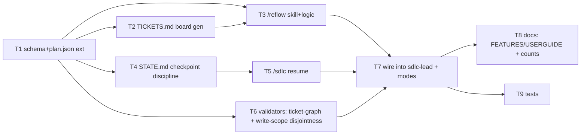

# Design — Module-Contract Tickets, Reflow, and Checkpoint/Resume

Status: **IMPLEMENTED** (T1–T9 complete) · Branch: `feat/sdlc-tickets-reflow-resume` · Date: 2026-07-01

> Shipped: T1 `scripts/lib/tickets.mjs` + `docs/TICKET_SCHEMA.md`; T2 `scripts/gen-tickets-board.mjs`;
> T3 `skills/reflow/`; T4 `agents/shared/CHECKPOINT_STATE.md`; T5 `/sdlc resume` (sdlc-lead); T6
> `scripts/validators/validate-tickets.sh`; T7 wired into sdlc-lead/guide/feature-mode; T8 docs/counts;
> T9 tests (Pass 4). All validators + 99 tests green.

## Why

Two gaps in the SDLC orchestrator today:

1. **No assignable, parallelizable unit of work.** `task-decomposer` emits a fine-grained
   `plan.json` DAG (one bounded artifact per node) sized for small-model execution. There is
   no *module contract* a contributor (or a contributor's own agent) can **claim** and own
   end-to-end — "you take the frontend dashboard page, I'll take the kanban board, she takes
   the DB backend, he takes the business logic" — without colliding.
2. **No clean clear-context-and-continue.** State is written (`sdlc-state.md`,
   `SDLC_TRACKER.md`, `HANDOFF_MANIFEST.md`) but nothing *rehydrates* from it on demand, and
   nothing tells the user "context is large — checkpoint written, safe to `/clear`, run
   `/sdlc resume` to continue."

This design adds a **module-contract ticket layer**, a **`/reflow`** step, and a
**checkpoint + `/sdlc resume`** discipline. It reuses the existing DAG, trackers, and
EXECUTOR_SELECTION machinery; it does not replace them.

## Decisions (locked)

| # | Decision | Choice |
|---|----------|--------|
| D1 | Unit of parallel ownership | **Module/epic contract layer** above `plan.json` nodes |
| D2 | Tracking surface | **In-repo** `docs/work/TICKETS.md` (board) + `plan.json` (graph), git-tracked |
| D3 | Reflow | **Dedicated `/reflow`** that recomputes the claimable set + flags collisions |
| D4 | Checkpoint/resume | **Checkpoint after each step** + **`/sdlc resume`**; context-budget nudge |

## Core concept — the Module Contract Ticket

A ticket is a **contract**, not an assignment to a specific agent. Any agent — built-in or a
contributor's own — may claim it as long as it honors the interface and write-scope. Tickets
are Jira-shaped and live in `plan.json` (machine) mirrored to `docs/work/TICKETS.md` (human).

```json
{
  "id": "M-frontend-dashboard",
  "kind": "module",                 // module | node (nodes are the existing fine-grained leaves)
  "title": "Dashboard main page",
  "owner": null,                     // agent name / contributor handle once claimed; null = unclaimed
  "status": "blocked",               // blocked | ready | claimed | in_progress | in_review | done
  "interface": "docs/design/api/dashboard.md",   // the contract other modules code against
  "write_scope": ["src/dashboard/**", "docs/reviews/dashboard/**"],  // exclusive edit territory
  "depends_on": ["M-db-backend", "M-design-system"],  // prereqs (the DAG edges)
  "acceptance": [                    // Jira-style acceptance criteria; each is checkable
    "renders live widgets from the dashboard API contract",
    "passes a11y (validate-wcag-coverage) and has an e2e smoke test",
    "no imports outside write_scope except declared interfaces"
  ],
  "verify": "scripts/validators/validate-... .sh",  // the gate that closes it
  "nodes": ["n12", "n13", "n14"],    // fine-grained plan.json nodes that implement it
  "after_replan": false
}
```

Invariants:
- **Write-scopes are disjoint** across simultaneously-claimable modules — that is what lets two
  people work at once without merge collisions. `/reflow` enforces this.
- A module is `ready` iff every `depends_on` module is `done` (only the *interface* of a dep
  needs to be `done`, not its full implementation — see "interface-first" below).
- **Interface-first unblocking:** a module that only needs a dependency's *contract* (not its
  code) depends on a lightweight `interface` node, which can be `done` long before the dep's
  implementation. This maximizes parallelism (frontend codes against the API contract while the
  backend is still being built).

## The board — `docs/work/TICKETS.md`

Human-readable mirror, regenerated from `plan.json`. One table + a mermaid DAG:

```markdown
# Tickets

| ID | Module | Status | Owner | Blocked by | Write-scope |
|----|--------|--------|-------|------------|-------------|
| M-db-backend | DB backend | done | db-architect | — | src/db/** |
| M-design-system | Design system | done | frontend-design | — | src/ui/tokens/** |
| M-frontend-dashboard | Dashboard page | ready | — | — | src/dashboard/** |
| M-kanban-board | Kanban board | ready | — | — | src/kanban/** |
| M-business-rules | Business logic | in_progress | coding-agent | — | src/domain/** |

​```mermaid
graph LR
  M-db-backend --> M-frontend-dashboard
  M-db-backend --> M-kanban-board
  M-design-system --> M-frontend-dashboard
  M-design-system --> M-kanban-board
  M-business-rules --> M-frontend-dashboard
​```
```

## `/reflow` — help someone pick up work

New skill `skills/reflow/` → drives the `sdlc-lead` (or a dedicated small step). Behavior:

1. Read `plan.json` + scan the repo for completed artifacts (each module's `verify` gate +
   `acceptance`). Mark modules `done` whose gate passes.
2. Recompute `status`: a module becomes `ready` when all `depends_on` are `done`.
3. Print the **claimable set** (`ready` + unclaimed) with each module's write-scope and
   acceptance criteria, so a newcomer can pick one.
4. **Collision check:** if two `in_progress`/`claimed` modules have overlapping `write_scope`,
   or an unclaimed `ready` module overlaps an `in_progress` one, flag it and refuse to hand off
   the overlapping one until resolved.
5. On claim, **emit a HANDOFF** (per `EXECUTOR_SELECTION.md`) for the claimed module to its
   chosen agent, with the module's interface + write-scope + acceptance as the task contract.
6. Regenerate `docs/work/TICKETS.md`.

`/reflow` is idempotent and read-mostly (only writes `plan.json` status + `TICKETS.md`), so it
is safe to run any time a contributor asks "what can I work on?"

## Checkpoint + `/sdlc resume`

**Checkpoint (write side).** After every SDLC step, the orchestrator writes a compact
`docs/work/STATE.md` (the single source of "where am I"):

```markdown
# STATE — <mode> <phase>
Updated: <stamp>
## Done
- <step/module + one line + artifact path>
## In flight
- <awaiting HANDOFF X → agent, manifest path>
## Next
- <the next step to run>
## Read to catch up (priority order)
1. docs/work/sdlc-state.md
2. docs/work/TICKETS.md
3. docs/sdlc/SDLC_TRACKER.md
4. <the 1-3 artifacts the next step needs>
```

`STATE.md` is capped (~one screen). Large artifacts are never inlined — only referenced (Rule 4:
write to disk, keep context lean).

**Resume (read side).** New `/sdlc resume`: reads `STATE.md` → `sdlc-state.md` →
`SDLC_TRACKER.md` → `HANDOFF_MANIFEST.md`, re-primes the six session rules
(`SESSION_PRIMER.md`), announces "you are at <mode/phase>, next is <X>", and continues. No
guessing from conversation history.

**Context-budget nudge.** When context crosses the `CONTEXT_BUDGET.md` threshold, the
orchestrator writes the checkpoint and prints: *"Checkpoint written to docs/work/STATE.md — safe
to `/clear`, then run `/sdlc resume` to continue."* (D4 recommended variant; auto-emit optional.)

## Handoff-rule compliance

- `/reflow` and `/sdlc resume` delegate only via HANDOFF blocks per `EXECUTOR_SELECTION.md`;
  neither assumes a spawn. A claimed module → one HANDOFF naming the target `/skill`.
- Module HANDOFFs carry the full contract (ROLE, CONTEXT, WRITE-SCOPE = the ticket's
  `write_scope`, PRODUCE = `acceptance`, VERIFY = `verify`, completion phrase).
- The new concurrent-dispatch validator (v1.26.5) already guards `/reflow` from shipping a
  gate-less parallel fan-out.

---

## Implementation plan — as module-contract tickets (dogfood)

The build is itself decomposed into claimable modules with a dependency DAG. Disjoint
write-scopes → these can be worked in parallel by separate contributors/agents.



| Ticket | Title | Depends on | Write-scope | Acceptance |
|--------|-------|-----------|-------------|------------|
| **T1** | Ticket schema + `plan.json` extension | — | `docs/design/**`, `scripts/lib/tickets.*` | Schema documented; a sample `plan.json` with `kind:module` validates; reader/writer helper exists |
| **T2** | `TICKETS.md` board generator | T1 | `scripts/gen-tickets-board.*` | Regenerates board + mermaid from `plan.json`; idempotent |
| **T3** | `/reflow` skill + logic | T1, T2 | `skills/reflow/**`, `agents/*reflow*` | Marks done, recomputes ready set, collision check, emits HANDOFF; read-mostly |
| **T4** | `STATE.md` checkpoint discipline | T1 | `agents/shared/CHECKPOINT_*`, edits to mode files' step loops | Every step writes capped STATE.md; "read to catch up" list present |
| **T5** | `/sdlc resume` | T4 | `skills/sdlc/**` (resume path), `agents/sdlc-lead.md` | Rehydrates from state files, re-primes, announces position |
| **T6** | Validators: ticket-graph integrity + write-scope disjointness | T1 | `scripts/validators/validate-tickets*.sh` | Fails on cyclic deps, overlapping write-scopes of concurrent modules, orphan nodes |
| **T7** | Wire `/reflow` + resume into `sdlc-lead` + modes | T3, T5, T6 | `agents/sdlc-lead.md`, `agents/sdlc-*mode.md` | Commands routed; PHASE_ROUTING updated; handoff-discipline clean |
| **T8** | Docs + counts | T7 | `docs/FEATURES.md`, `docs/USERGUIDE.md`, `README.md` | New skills/validators cataloged; `validate-doc-counts` clean |
| **T9** | Tests | T7 | `scripts/test.ts` fixtures | Reflow/resume/validators covered; suite green |

**Parallelizable now (interface-first):** T1 is the only root. Once T1's *schema* is fixed
(interface), T2/T4/T6 can proceed concurrently against it (disjoint scopes). T3 needs T1+T2;
T5 needs T4; T7 is the join point.

## Open questions for review
- Should `/reflow` also **mirror** the claimable set to Gitea issues (D2 left this out)? Deferred.
- Auto-checkpoint at the context threshold (D4 optional variant) — include in T4 or defer?
- Contributor identity for `owner` — free-text handle, or require a registered agent name?
