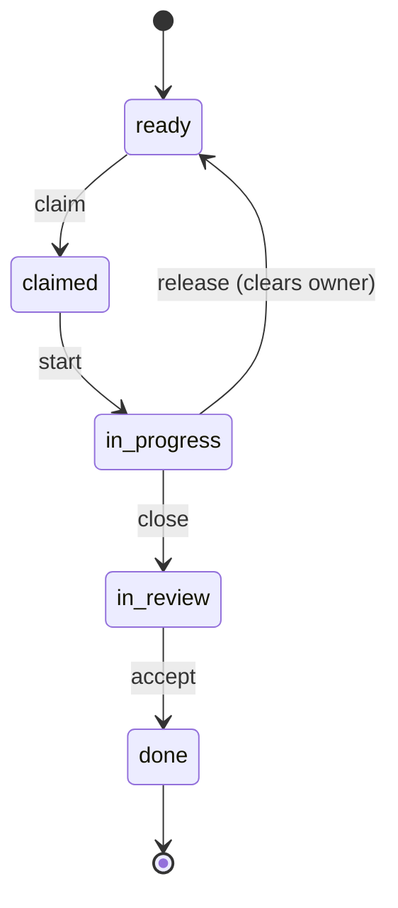

# Module-Contract Ticket Schema (T1)

Canonical schema for the module layer added to `plan.json`. Machine contract for
`scripts/lib/tickets.mjs`, the `/reflow` skill (T3), and the ticket validators (T6).
Human-facing rationale lives in `docs/SDLC_TICKETS_REFLOW_RESUME_PLAN.md`.

## Shape

`plan.json` gains an **optional** top-level `modules[]` array alongside the existing
task-decomposer `nodes[]`. A plan with only `nodes[]` stays valid (backward compatible).

```json
{
  "goal": "string",
  "modules": [ <ModuleTicket>, ... ],   // optional; the assignable contract layer
  "nodes":   [ <Node>, ... ]            // existing fine-grained DAG (unchanged)
}
```

## ModuleTicket

| Field | Type | Required | Meaning |
|-------|------|----------|---------|
| `id` | string, unique across modules+nodes | yes | Stable ticket id, e.g. `M-frontend-dashboard` |
| `kind` | `"module"` | yes | Discriminates from a `node` |
| `title` | string | yes | Human label for the board |
| `lane` | string | yes | Parallel-safety partition (project-defined, e.g. `frontend`/`backend`/`design`/`infra`/`docs`). The guarantee a lane makes: two modules in *different* lanes never share `write_scope` — that's what makes "different lane = safe to start in parallel" true. Modules in the *same* lane may still collide; that's an ordinary sequencing concern, not a lane violation. |
| `owner` | string \| null | yes | Free-text handle (`"brad"`) or agent name (`"coding-agent"`); `null` = unclaimed |
| `status` | enum | yes | `blocked` \| `ready` \| `claimed` \| `in_progress` \| `in_review` \| `done` |
| `interface` | string (path) | recommended | The contract other modules code against (enables interface-first parallelism) |
| `write_scope` | string[] (globs), non-empty | yes | Exclusive edit territory. Disjoint across concurrently-workable modules. **Must include the test files for every implementation file it lists** — either a glob that covers them (`src/**`) or the explicit siblings (`src/parse.js` *and* `src/parse.test.js`). A scope that names implementation alone while acceptance demands tests is unsatisfiable: the agent is required to write tests and forbidden from writing them, and its only honest moves are to self-block or delete the tests it just wrote. Both have happened in the field; `testSiblingWarnings()` flags it at plan time |
| `depends_on` | string[] (module ids) | yes | DAG edges. Satisfied when each referenced module is `done` |
| `acceptance` | string[], non-empty | yes | Jira-style checkable criteria = the module's PRODUCE contract |
| `verify` | string (path) | recommended | The gate that closes the ticket (validator script / challenger) |
| `nodes` | string[] (node ids) | optional | Fine-grained `plan.json` nodes implementing this module |
| `stories` | string[] (USER_STORIES.md IDs, e.g. `US-01`, `E1.1`) | optional | **T29.2.** The requirement/user-story layer this module implements. Structurally a sibling of `nodes` — both are "what does this module carry" pointers into a different artifact (plan.json nodes vs. `docs/USER_STORIES.md` headings) — but `stories` is graded externally (against USER_STORIES.md, not plan.json), so it is NOT part of `validatePlan()`'s referential-integrity pass the way `nodes` is; see "Requirement (story) coverage & closure" below for how it's actually checked. Backward compatible: a module with no `stories` field is untouched by every check this field adds. |
| `after_replan` | boolean | optional | Recompute this ticket after a scout/replan node returns |
| `manifest` | string (path) | required for `close` | Path (relative to `plan.json`'s directory) to this ticket's Completion Manifest — a **`.md` document**, conventionally `docs/reviews/MANIFEST_<id>.md`. `close()` refuses unless this file exists on disk. **Under the conductor it must live in `docs/work/` or `docs/reviews/`** (validate-scope.sh's always-allowed dirs, enforced by G6): the session is told to *write* the manifest at this path, so anywhere else is written as instructed and then refused as out-of-scope, and pointing it at a source file makes the session overwrite its own deliverable with markdown |
| `history` | `{ts,actor,from,to,note}[]` | machine-managed | Append-only transition log written by the lifecycle verbs (T26.1). Never hand-edited — the audit trail the 2026-07-07 incident showed doesn't exist otherwise. |
| `evidence` | `{branch,commits[],verify_cmd}` \| absent | machine-managed | Set by `close()` on success — records what was actually verified, not just claimed. |
| `claimed_at` | string (ISO timestamp) \| null | machine-managed | Set by `claim()`, cleared by `release()`. |

## Status semantics

- **Auto-resolved** (`recomputeStatus`): only `blocked` ⇄ `ready`. A module is `ready` iff every
  `depends_on` module is `done`, else `blocked`.
- **Owned/terminal** (`claimed`, `in_progress`, `in_review`, `done`): set ONLY by the lifecycle
  verbs below (T26.1) — never hand-edited, never auto-changed by `recomputeStatus`.
- **Claimable** = `ready` AND `owner == null`.

## Lifecycle (T26.1) — enforced transition graph



Agents never hand-edit `status`/`owner` again — these six CLI verbs (also exported as functions
from `scripts/lib/tickets.mjs`, implemented in `scripts/lib/tickets-lifecycle.mjs`) are the only
sanctioned path, and each appends an immutable `history[]` entry:

- **`claim <plan> <id> <actor>`** — refused unless `ready` + unowned; refused if `actor` already
  owns another `claimed`/`in_progress` ticket (**WIP=1**). Sets `claimed_at`. **T26.3:** also refused
  if the ticket graph itself is unhygienic (`validatePlan()`/`writeScopeCollisions()` red) — the
  refuse-to-select-next-work gate. Scoped to `claim` only; `start` (below) is never gated on this,
  since it only ever advances a ticket the actor already owns.
- **`start <plan> <id> <actor>`** — `claimed → in_progress`. Owner-only. **T26.3:** returns a
  paste-able "`── start receipt: <id> ──`" (actor, status transition, timestamp) — the required
  Stage 0 artifact of the `/reflow` claim HANDOFF template (`skills/reflow/SKILL.md`), proving the
  executor actually started the claimed ticket rather than silently skipping straight to work.
- **`comment <plan> <id> <actor> <note>`** — appends free-text history at any time, any state.
  Does not change status.
- **`close <plan> <id> <actor> --branch <b> --commits <c1,c2,...>`** — `in_progress → in_review`.
  The load-bearing gate: refused unless **all** of (a) `module.manifest` exists on disk, (b)
  `module.verify` — and *only* `module.verify*, never a caller-supplied override* — exits 0 when
  run by this code, (c) `branch` + at least one commit supplied. Sets `evidence`, prints a
  paste-able receipt. **T26.3:** this receipt, pasted verbatim into the manifest, is now the ONLY
  accepted completion signal — see `accept` below.
- **`accept <plan> <id> <actor>`** — `in_review → done`. Reviewer-only: refused if `actor` is the
  same as the ticket's `owner` (don't accept your own work — the 3-layer-check split). **T26.3:**
  also refused unless the module's Completion Manifest (`module.manifest`, resolved relative to
  `plan.json`'s directory) has the `close()` receipt pasted into it verbatim
  (`manifestHasCloseReceipt()`) — required fields present, `status: in_review`, and the recorded
  `branch`/every recorded `commit` from `module.evidence` present in the pasted text (defeats a
  hand-typed block that merely matches the header shape). A manifest that only carries a
  self-asserted "`<id> done -- ...`" phrase is refused — this is the code-enforced gate behind the
  planted acceptance test "a HANDOFF completing without a close receipt must be rejected."
- **`release <plan> <id> <actor> <reason>`** — `claimed`/`in_progress` → `ready`, clears
  `owner`/`claimed_at`. Requires a non-empty reason; staleness/abandonment is a human/reflow
  decision, never silent.
- **`open-for <plan> <actor>`** (T26.3, read-only) — reports (non-zero + reason) if `actor` already
  owns a `claimed`/`in_progress` ticket elsewhere; the query `claim`'s WIP=1 check is built on,
  exposed separately so a caller (e.g. `run-until-done.sh`'s preflight) can ask "is it safe to hand
  this actor NEXT work" without attempting a specific claim. `in_review` does not count as open —
  that ticket has already been closed via a receipt, only `accept()` is outstanding.
- **`check-receipt <plan> <id>`** (T26.3, read-only) — runs the same `manifestHasCloseReceipt()`
  check `accept()` enforces, for use by `scripts/validators/validate-close-receipt.sh` (gate-sweep
  / CI consumption) and manual review before running `accept`.

Every verb returns non-zero and a `[x] <reason>` message on refusal; `plan.json` is only
persisted back to disk when a verb succeeds.

## Invariants (enforced by the lib; T6 turns these into a gate)

1. Ids unique across `modules[]` and `nodes[]`.
2. `depends_on` references existing module ids; the module DAG is acyclic.
3. `module.nodes` reference existing `plan.nodes` ids.
4. **Write-scopes of active modules in the SAME lane are disjoint.** `writeScopeCollisions()`
   flags any same-lane overlap where at least one side is active
   (`claimed`/`in_progress`/`in_review`) — that is the condition under which two contributors
   in the same lane would clobber each other.
5. **Write-scopes never overlap ACROSS different lanes — checked unconditionally, any status.**
   `crossLaneCollisions()` (folded into `validatePlan()`'s errors) flags any overlap between two
   modules whose `lane` differs, regardless of `status`. This is a schema-validity error, not a
   runtime race: the entire point of a lane is the guarantee that a different lane is safe to
   start in parallel, so a plan where two different lanes touch the same files is malformed the
   moment it's written, whether or not either module has been claimed yet. (Same-lane overlap is
   fine at this level — invariant 4 catches it only once it becomes active.)

## Requirement (story) coverage & closure (T29.2)

The field-lesson gap this closes: before T29.2, `ModuleTicket` had no requirement/story field at
all, so a plan could show every module `done` while a real user story was never implemented —
**task closure** (all tickets closed) was silently standing in for **requirement closure** (all
stories delivered), the same self-graded-honor-system defect class M26/M27 diagnosed elsewhere in
this program (A-6.3 in the field report). `stories[]` is the structural link; two checks build on
it, at two different points in the lifecycle:

1. **Story-coverage check (`validate-tickets.sh`, chained at phase-4)** — advisory. A story that
   exists in `docs/USER_STORIES.md` but is referenced by `stories[]` in **zero** modules is
   printed as a `[!]` warning (`scopeCoverageWarnings`'s sibling: same "surface it, don't block on
   it yet" posture used for scope-gap detection). **Configurable to a hard gate**: set
   `STORY_COVERAGE_STRICT=1` in the validator's environment to promote these from `[!]` to `[x]`
   (fails `validate-tickets.sh`/phase-4). Off by default so adopting `stories[]` on an
   already-in-flight plan doesn't retroactively break an unrelated phase-4 gate.
2. **Requirement-closure gate (`validate-requirement-closure.sh`, chained at phase-5)** —
   unconditional, not configurable. A story is **closed** only when it is referenced by at least
   one module AND every module referencing it is `status: "done"`; otherwise it is **open**
   (covers both "orphan story, zero modules" and "some/all referencing modules not done yet"). Any
   open story fails phase-5 — this is the mechanism behind the ticket's red fixture: **a plan
   where every module shows `done` still fails phase-5 if a story is unmapped**, because task
   closure and requirement closure are computed independently and phase-5 gates on the latter.
   This validator also requires the reconciliation matrix artifact below to exist and cover every
   story with no `OUTSTANDING` verdicts — "all modules done" is a plan.json-only signal; the
   matrix is where a human/agent actually looks at the code, not just the ticket's self-reported
   status.

**Mandatory reconciliation HANDOFF** (Template 11, `agents/shared/HANDOFF_TEMPLATES.md`) — before
phase-5, an agent walks `docs/USER_STORIES.md` story-by-story against the real code (not the
ticket's status field) and writes `docs/work/REQUIREMENT_RECONCILIATION.md`: one row per story,
verdict `DONE` / `PARTIAL` / `OUTSTANDING`, evidence (files/tests/commits). `PARTIAL` is allowed
through phase-5 (disclosed, not silently missing); `OUTSTANDING` is not — a story a human hasn't
even looked at yet cannot be asserted requirement-closed.

Worked example against a real, external, unmodified project (not a synthetic fixture):
[`docs/work/examples/repopulse-reconciliation-example.md`](work/examples/repopulse-reconciliation-example.md)
— also documents the epic-level fallback for projects that haven't adopted `stories[]` yet.

## Generated project status: built-vs-done split + freshness (T29.3)

`scripts/gen-status-report.mjs` regenerates `docs/work/STATUS.md` from the same two layers
`requirementClosure()` reads: task closure (`plan.modules[].status === 'done'`, "platform /
foundation built") and, when `docs/USER_STORIES.md`/`stories[]` are adopted, requirement closure
("features complete"). A phase is painted complete only when **both** layers are 100% — 100% tasks
with any open story renders `🟡 BUILT — FEATURES INCOMPLETE`, never green (this is what closes
C-1/H7: a hand-written STATUS.md could previously claim "done" off task closure alone, the same
defect T29.2 closed for the phase-4→5 gate). Pure derivation lives in
`scripts/lib/status-report.mjs` (`computeStatusReport`, `renderStatusMarkdown`,
`checkStatusFreshness`, `lastWorkEvent`) so the generator and the freshness check share one
source of truth.

**Freshness.** Every generated `STATUS.md` embeds a `<!-- STATUS_REPORT_META {...} -->` JSON
comment (numbers + `generatedAt` + the plan's own last work event — the latest `history[]`/
`claimed_at` timestamp across all modules). `node scripts/gen-status-report.mjs <plan> <stories>
<out> --check` (wrapped by `scripts/validators/validate-status-freshness.sh`) flags the artifact
**stale** when its embedded numbers mismatch a live recompute against the current `plan.json`, or
the plan has a work event newer than `generatedAt`. Not chained into a phase gate — STATUS.md is a
rolling dashboard artifact, not a phase deliverable — the intended caller is the steward skill
(`/steward audit`, see `skills/steward/SKILL.md`).

CLI: `node scripts/gen-status-report.mjs [plan.json] [user-stories.md] [out.md]` · `... --check`
(freshness only, doesn't regenerate).

## API (`scripts/lib/tickets.mjs`)

```
loadPlan(path) · savePlan(path, plan)
validatePlan(plan)            -> { ok, errors[] }   // includes lane-required + cross-lane collision errors
recomputeStatus(plan)         -> plan (blocked/ready resolved)
claimable(plan)               -> ModuleTicket[]
claimableByLane(plan)         -> { lane, modules: ModuleTicket[] }[]   // T10.3 — claimable() grouped by lane;
                                                                        // every lane present gets a bucket, even an empty one
laneOf(module) -> string · UNASSIGNED_LANE = '(unassigned)'   // shared lane-grouping helpers (tickets.mjs + gen-tickets-board.mjs)
writeScopeCollisions(plan)    -> { a, b, scope }[]           // same-lane, active-status only
crossLaneCollisions(plan)     -> { a, b, lane_a, lane_b, scope }[]   // cross-lane, any status
openTicketFor(plan, actor, excludeId?)     -> ModuleTicket | null   // T26.3 — the query claim()'s WIP=1 is built on
manifestHasCloseReceipt(manifestPath, id, evidence)  -> { ok, reason? }   // T26.3 — accept()'s enforcement
storyCoverageWarnings(plan, storyIds)  -> { id, msg }[]      // T29.2 — stories in storyIds with no referencing module
requirementClosure(plan, storyIds)     -> { stories: { id, status: 'closed'|'open', reason?, modules: string[] }[], openCount, closedCount }  // T29.2
```

Story ids come from `scripts/lib/user-stories.mjs`'s `extractStoryIds(markdown)` — parses
`docs/USER_STORIES.md` headings shaped like `## US-01 <title>` or `### E1.1 <title>` (an
`##`–`####` heading whose first token contains a digit; generic headings like `## Epic E1 — ...`
or `## Summary` are skipped since "Epic"/"Summary" have no digit immediately after the `#`s).

CLI: `node scripts/lib/tickets.mjs validate <plan.json> [user-stories.md]` · `... status <plan.json>` ·
`... open-for <plan.json> <actor>` · `... check-receipt <plan.json> <id>` ·
`... requirement-status <plan.json> <user-stories.md>` (T29.2 — exit 0 all stories closed / 1 any open)

Reference sample: `examples/tickets-plan.sample.json` (validates; every module has a `lane`;
`status` resolves two blocked frontend modules to claimable once their `done` deps are met).
