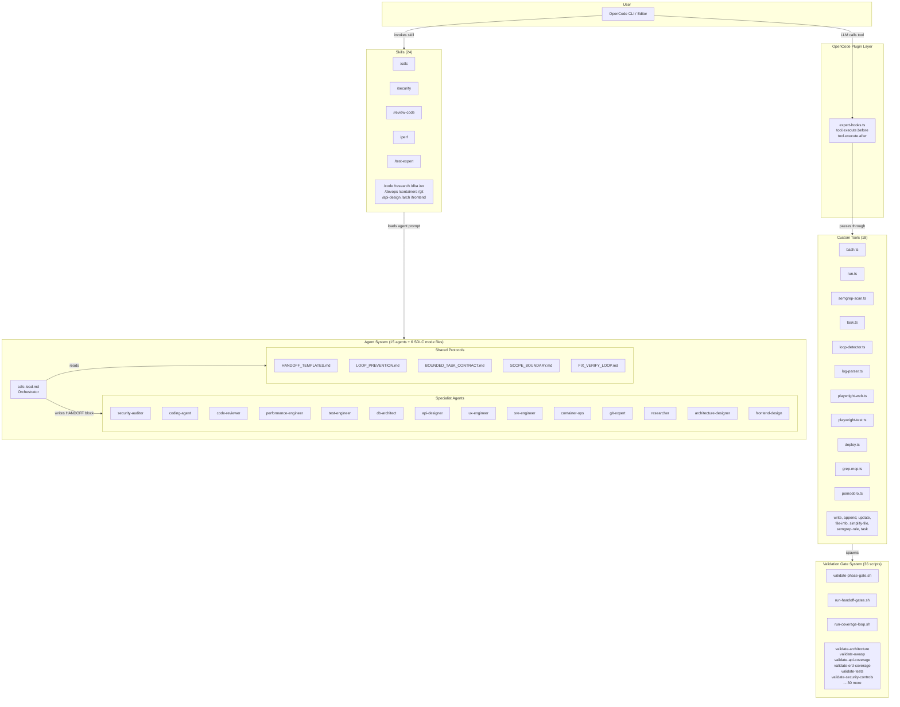

[🏠 Index](README.md)  |  [← System Overview](01-overview.md)  |  [Plugin Hook System →](03-plugin-hooks.md)

---

# 2. Component Architecture

### Directory Structure

| Directory | Purpose |
|-----------|---------|
| `agents/` | Agent prompt files (`.md`) — one per specialist |
| `agents/shared/` | Shared protocol files (HANDOFF, LOOP_PREVENTION, etc.) |
| `agents/security/` | OWASP deep-mode methodology |
| `agents/code-review/` | Code review methodology |
| `agents/performance/` | Performance engineering methodology |
| `agents/templates/` | SDLC document templates |
| `skills/` | Slash command definitions (24 skills) |
| `commands/` | Alternative command files for SDLC workflow |
| `tools/` | Custom TypeScript tool implementations (18 tools) |
| `plugins/` | OpenCode plugin (`expert-hooks.ts`) |
| `references/` | Curated reference checklists (OWASP, REST, git, etc.) |
| `scripts/` | Shell scripts (validators, install helpers, detect SDLC state) |
| `scripts/validators/` | 36 phase gate validators |
| `docs/` | Project documentation |

---

---

[🏠 Index](README.md)  |  [← System Overview](01-overview.md)  |  [Plugin Hook System →](03-plugin-hooks.md)
