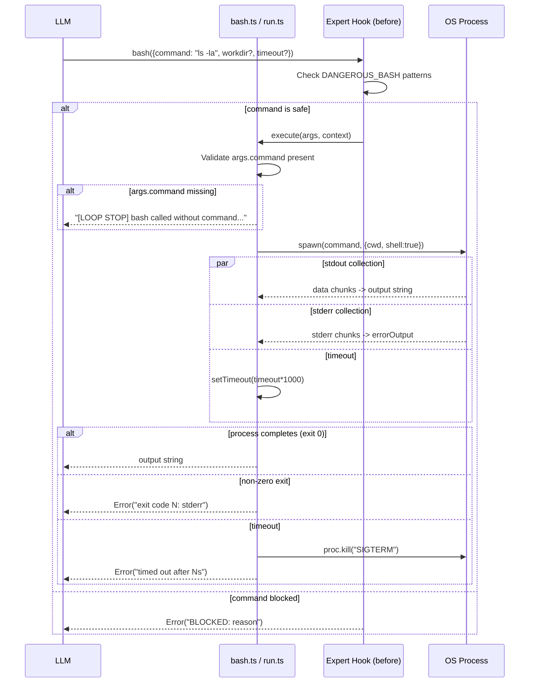
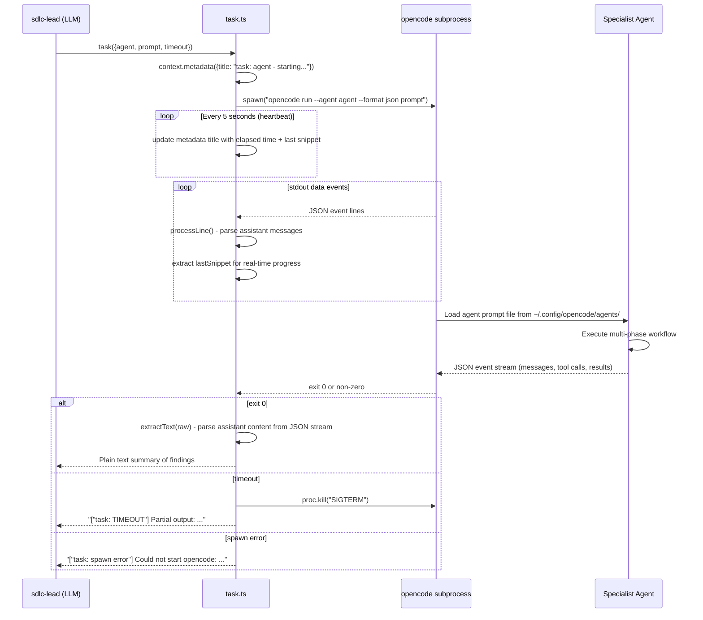

[🏠 Index](README.md)  |  [← Plugin Hook System](03-plugin-hooks.md)  |  [Agent System →](05-agents/README.md)

---

# 4. Tool System

### 4.1 Tool Catalog

| Tool | File | Lines | Purpose |
|------|------|-------|---------|
| `bash` | `bash.ts` | 67 | Execute arbitrary shell commands with timeout |
| `run` | `run.ts` | 65 | Alias of bash — execute shell commands |
| `semgrep-scan` | `semgrep-scan.ts` | 65 | Run Semgrep security scans on codebase |
| `task` | `task.ts` | 238 | Delegate to specialist agents via `opencode run --agent` |
| `loop-detector` | `loop-detector.ts` | 176 | Detect and break infinite loops in agent behavior |
| `log-parser` | `log-parser.ts` | 183 | Parse and structure log output from tools |
| `playwright-web` | `playwright-web.ts` | 106 | Browser automation for web research |
| `playwright-test` | `playwright-test.ts` | 63 | Run Playwright E2E tests |
| `deploy` | `deploy.ts` | 102 | Execute deployment operations |
| `grep-mcp` | `grep-mcp.ts` | 115 | Search file contents with regex |
| `pomodoro` | `pomodoro.ts` | 168 | Time-box tasks with Pomodoro timer |
| `write` | `write.ts` | 22 | Write content to a file |
| `append` | `append.ts` | 30 | Append content to a file |
| `update` | `update.ts` | 22 | Update/replace file content |
| `file-info` | `file-info.ts` | 42 | Get file metadata |
| `simplify-file` | `simplify-file.ts` | 81 | Simplify/compress a file's content |
| `semgrep-rule` | `semgrep-rule.ts` | 67 | Create custom Semgrep rules |
| `test-runner` | `test-runner.ts` | 183 | Run test suites and parse results |

### 4.2 Shell Command Execution Flow

Both `bash.ts` and `run.ts` follow the same pattern:

### 4.3 Task Delegation Flow (task.ts)

The `task.ts` tool spawns a sub-agent by running `opencode run --agent <type>`.

> **Note:** `task.ts` is available as a tool, but the SDLC lead's prompt explicitly instructs it NOT to use `task()` because it was found to timeout in production for multi-phase agents. Delegation instead uses HANDOFF blocks — see Section 7.

---

---

[🏠 Index](README.md)  |  [← Plugin Hook System](03-plugin-hooks.md)  |  [Agent System →](05-agents/README.md)
