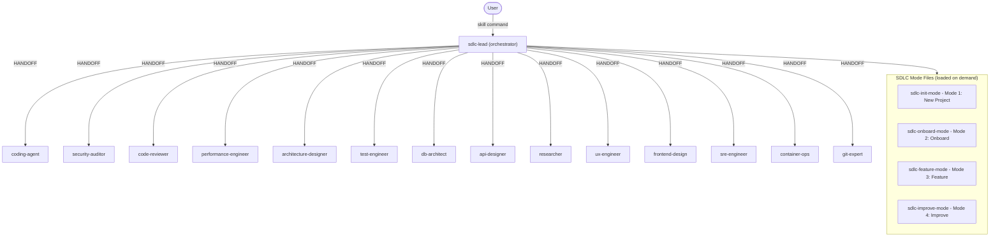

[🏠 Book](../README.md)  |  [📖 Chapter](README.md)  |  [SDLC Orchestrator →](02-sdlc-orchestrator.md)

---

# 5.1 Agent Overview

## Agent Catalog

| Agent file | Skill | Domain |
|-----------|-------|--------|
| `sdlc-lead.md` | `/sdlc` | Orchestrator — routes, tracks, delegates |
| `coding-agent.md` | `/code` | Doc-driven implementation, anti-slop rules |
| `security-auditor.md` | `/security` | OWASP, Semgrep, attack chains, CVE |
| `code-reviewer.md` | `/review-code` | Code health, complexity, tech debt |
| `performance-engineer.md` | `/perf` | Profiling, benchmarks, bottleneck diagnosis |
| `architecture-designer.md` | `/architect` | Module structure, plugin points, infra topology |
| `test-engineer.md` | `/test-expert` | Playwright, vitest, test strategy, coverage |
| `db-architect.md` | `/dba` | Schema design, migrations, query optimization |
| `api-designer.md` | `/api-design` | REST/GraphQL contracts, OpenAPI |
| `researcher.md` | `/research` | Web research, tech comparisons, feasibility |
| `ux-engineer.md` | `/ux` | UX workflows, WCAG, component architecture |
| `frontend-design.md` | `/frontend` | Visual implementation, tokens, design systems |
| `sre-engineer.md` | `/devops` | CI/CD, runbooks, monitoring, deployment |
| `container-ops.md` | `/containers` | Podman/Docker, compose, image debugging |
| `git-expert.md` | `/git-expert` | Branching, commits, releases, forensics |

## Shared Protocol Files

All agents load these from `agents/shared/` as needed:

| File | Purpose |
|------|---------|
| `HANDOFF_TEMPLATES.md` | Canonical HANDOFF block format (4 templates) |
| `LOOP_PREVENTION.md` | Hard caps on tool loops (failure, schema, success classes) |
| `BOUNDED_TASK_CONTRACT.md` | 6 rules for every HANDOFF specialist |
| `SCOPE_BOUNDARY.md` | Stay-in-lane rules — which agent owns what |
| `FIX_VERIFY_LOOP.md` | Protocol for fix → verify → confirm cycles |
| `RALPH_WIGGUM_LOOP.md` | Deep-mode exhaustive inventory loop |
| `ANTI_SLOP_RULES.md` | Anti-overengineering rules for coding-agent |
| `RESEARCH_TOOLS.md` | Web research tool usage guide |
| `BOOK_PROTOCOL.md` | Deliverables over 300 lines must be books |
| `CONTEXT_BUDGET.md` | Context window management for small LLMs |
| `SESSION_PRIMER.md` | Session startup checklist |

## Agent Hierarchy

---

[🏠 Book](../README.md)  |  [📖 Chapter](README.md)  |  [SDLC Orchestrator →](02-sdlc-orchestrator.md)
