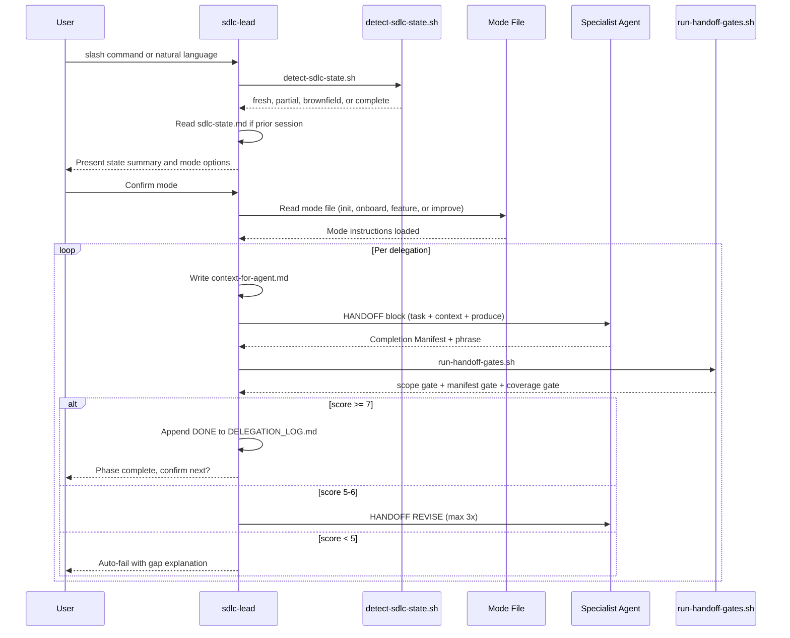
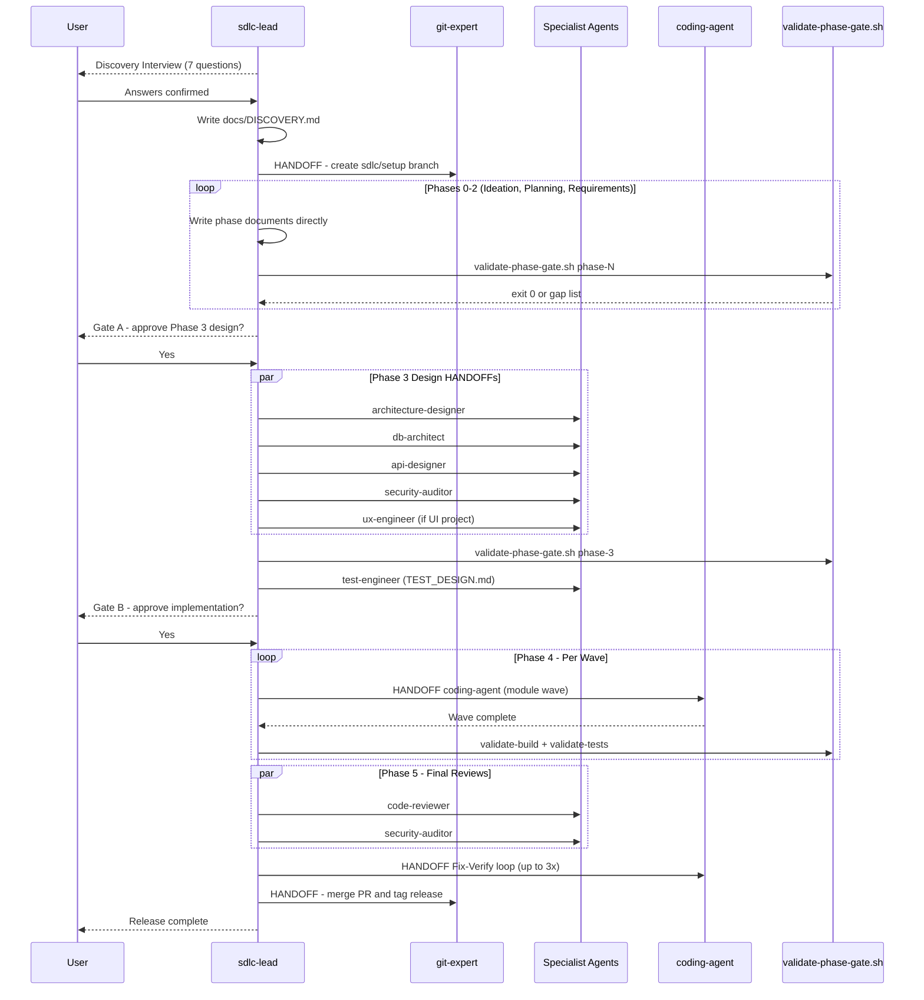
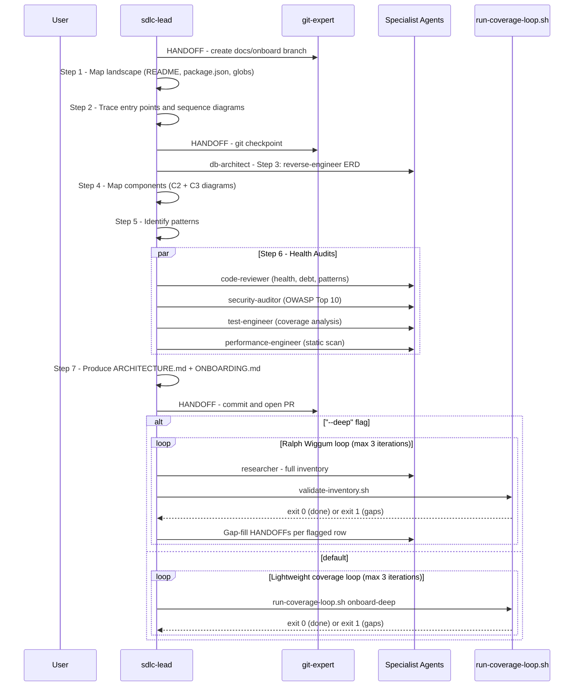
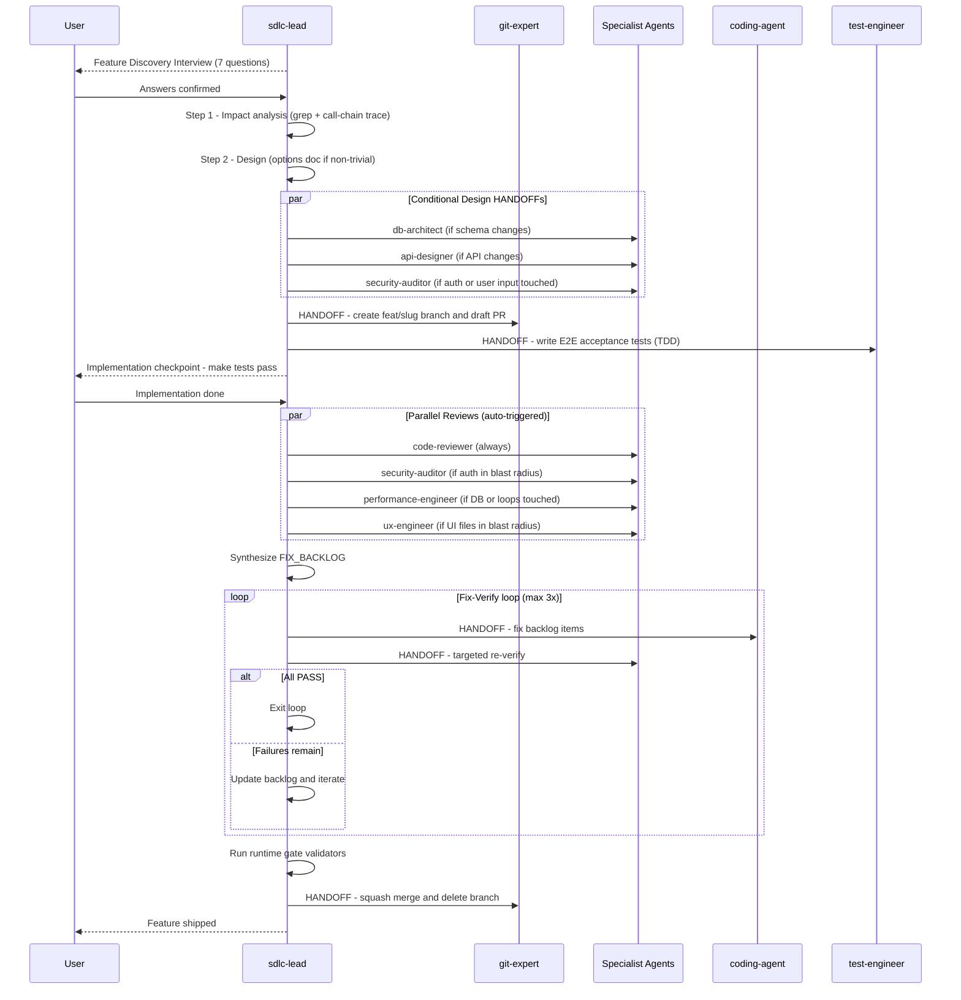
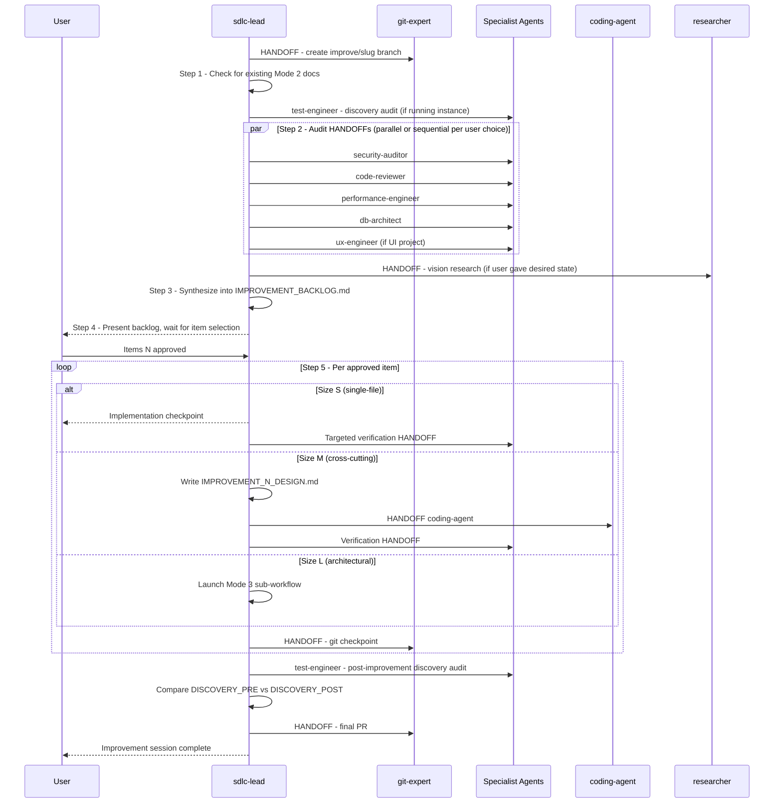

[🏠 Book](../README.md)  |  [📖 Chapter](README.md)  |  [← Overview](01-overview.md)  |  [Coding Agent →](03-coding-agent.md)

---

# 5.2 SDLC Orchestrator

The orchestrator is split across five files loaded on demand: `sdlc-lead.md` (spine) + one mode file per session.

## sdlc-lead — Startup and Gate Loop

Every session starts with state detection and mode routing. Every HANDOFF return passes a 3-gate scoring loop before advancing.

**Human approval gates:**
- **Gate A** (Phase 2 → 3): blocks before any design docs are written
- **Gate B** (Phase 3.5 → 4): blocks before any coding HANDOFFs are emitted

---

## Mode 1 — New Project (sdlc-init-mode)

---

## Mode 2 — Onboard Existing Codebase (sdlc-onboard-mode)

Three depth levels: `--quick` (steps 1-7 only), default (+ lightweight inventory loop), `--deep` (+ Ralph Wiggum exhaustive loop).

---

## Mode 3 — Add Feature (sdlc-feature-mode)

---

## Mode 4 — Audit and Improve (sdlc-improve-mode)

---

[🏠 Book](../README.md)  |  [📖 Chapter](README.md)  |  [← Overview](01-overview.md)  |  [Coding Agent →](03-coding-agent.md)
