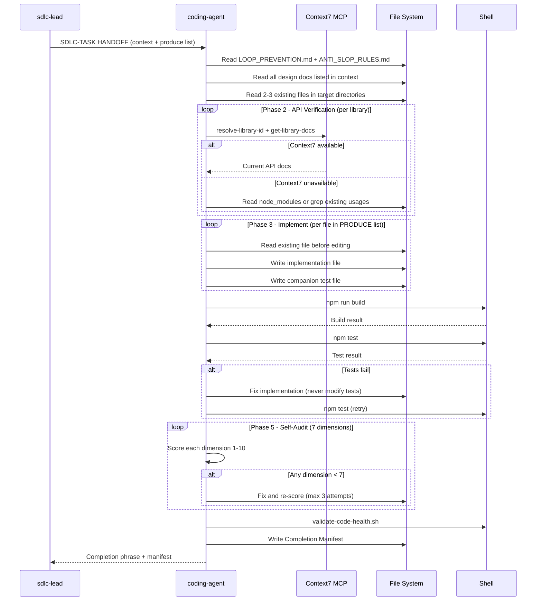

[🏠 Book](../README.md)  |  [📖 Chapter](README.md)  |  [← SDLC Orchestrator](02-sdlc-orchestrator.md)  |  [Security Auditor →](04-security-auditor.md)

---

# 5.3 Coding Agent

**File:** `agents/coding-agent.md` | **Skill:** `/code`

Doc-driven implementation engineer. Refuses to start without a design spec and enforces strict anti-slop rules on every file written. Runs API verification via Context7 MCP before writing any library call.

## Execution Flow

## Self-Audit Dimensions

| Dimension | What it checks |
|-----------|---------------|
| Correctness | Logic matches spec requirements |
| Test coverage | Happy path, error path, and edge cases covered |
| Anti-slop | No over-engineering, no premature abstraction |
| Pattern matching | Matches conventions from existing files |
| Tech stack compliance | No unapproved libraries |
| Scope compliance | Only files listed in PRODUCE were written |
| Code clarity | No comments explaining what (only why when non-obvious) |

## Deliverables

- Implementation files (exactly those named in the PRODUCE list)
- Companion test files alongside each module
- Verification doc under `docs/improve/VERIFY_ITEM_N.md`
- Completion Manifest with anti-slop checklist, test result, deferred items

---

[🏠 Book](../README.md)  |  [📖 Chapter](README.md)  |  [← SDLC Orchestrator](02-sdlc-orchestrator.md)  |  [Security Auditor →](04-security-auditor.md)
