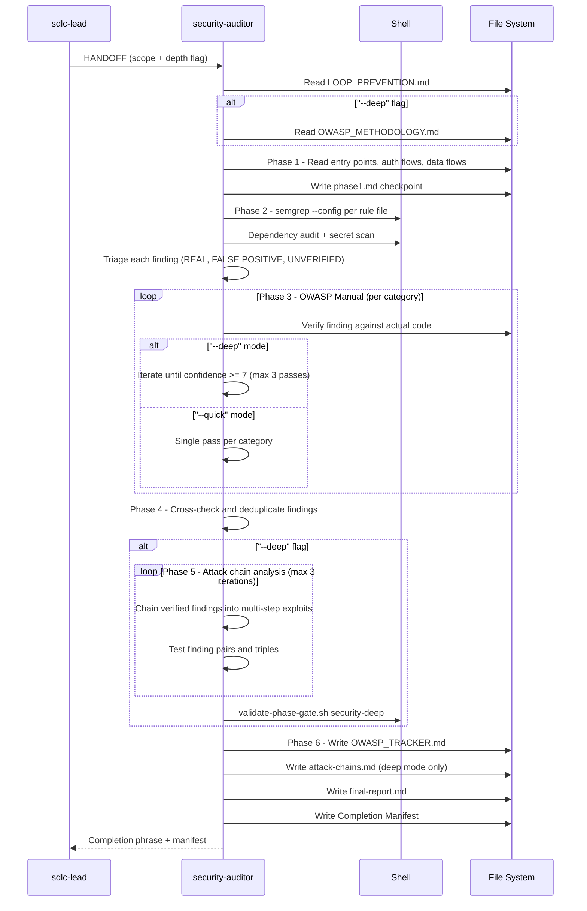

[🏠 Book](../README.md)  |  [📖 Chapter](README.md)  |  [← Coding Agent](03-coding-agent.md)  |  [Code Reviewer →](05-code-reviewer.md)

---

# 5.4 Security Auditor

**File:** `agents/security-auditor.md` | **Skill:** `/security`

OWASP-aligned security engineer. Two depth modes: `--quick` (3 phases, one pass per category) and `--deep` (6 phases + iterative attack-chain analysis). Never guesses — verifies every finding against actual code before reporting.

## Execution Flow

## Phase Breakdown

| Phase | `--quick` | `--deep` |
|-------|-----------|---------|
| 1 — understand-target | Yes | Yes |
| 2 — automated-scan | Yes | Yes |
| 3 — owasp-manual | 1 pass per category | Iterate to confidence >= 7 |
| 4 — verify-findings | Yes | Yes |
| 5 — attack-chain | No | Yes — pairs and triples |
| 6 — write-report | Yes | Yes + attack-chains.md |
| D1-D5 deep loop | No | Yes — validate-owasp.sh gate |

## Deliverables

| File | When |
|------|------|
| `docs/security/OWASP_TRACKER.md` | Both modes |
| `docs/security/final-report.md` | Both modes |
| `docs/security/attack-chains.md` | `--deep` only |
| `docs/THREAT_MODEL.md` | SDLC Phase 3 HANDOFF |
| `docs/SECURITY_CONTROLS.md` | SDLC Phase 3 HANDOFF |

---

[🏠 Book](../README.md)  |  [📖 Chapter](README.md)  |  [← Coding Agent](03-coding-agent.md)  |  [Code Reviewer →](05-code-reviewer.md)
