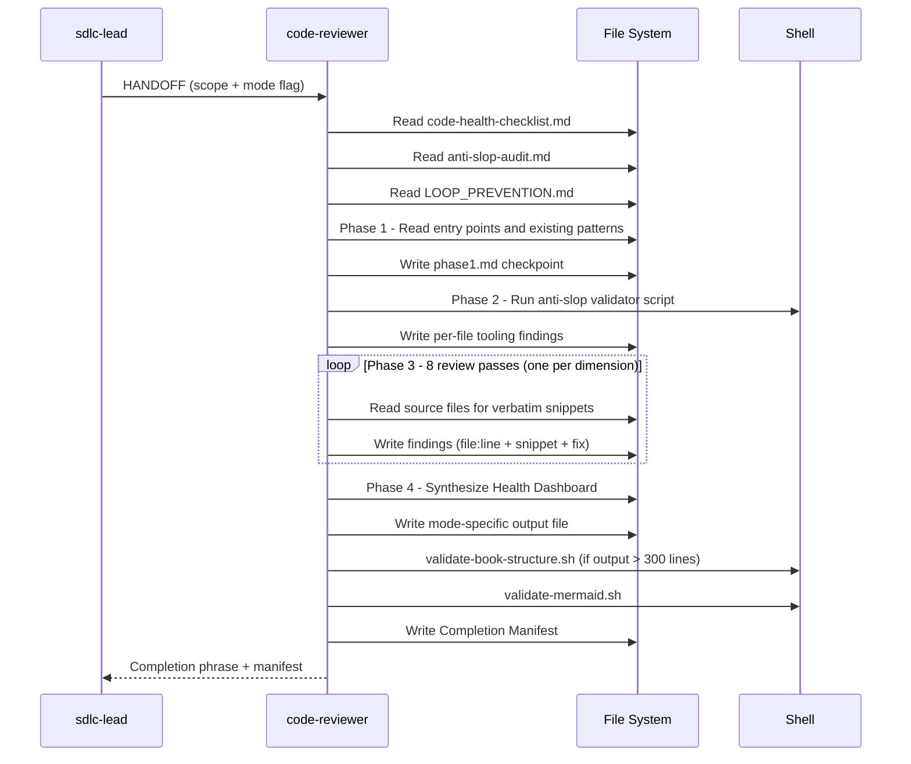

[🏠 Book](../README.md)  |  [📖 Chapter](README.md)  |  [← Security Auditor](04-security-auditor.md)  |  [Performance Engineer →](06-performance-engineer.md)

---

# 5.5 Code Reviewer

**File:** `agents/code-reviewer.md` | **Skill:** `/review-code`

Senior code-health auditor covering 8 quality dimensions. Flags and routes — does not fix security issues or performance bottlenecks. Operates in 4 output modes and an optional Phase Mode for single-phase execution.

## Execution Flow

## Output Modes

| Flag | Output file | What it covers |
|------|-------------|---------------|
| `--review` | `docs/reviews/CODE_REVIEW_date.md` | Full 8-dimension health pass + Health Dashboard |
| `--debt` | `docs/reviews/TECH_DEBT_date.md` | Prioritized tech-debt backlog |
| `--consolidate` | `docs/reviews/CONSOLIDATION_date.md` | DRY and error-handling consolidation proposals |
| `--patterns` | `docs/reviews/PATTERNS_date.md` | Cross-codebase pattern consistency audit |

## 8 Review Dimensions

Maintainability, error handling, test quality, code duplication, complexity, naming clarity, dependency hygiene, security-adjacent patterns (flagged for security-auditor, not fixed here).

## Routing Rules

Findings in security, performance, database, UX, or API domains are listed in a `## Handoffs` section pointing to the responsible specialist — the code-reviewer does not fix them.

---

[🏠 Book](../README.md)  |  [📖 Chapter](README.md)  |  [← Security Auditor](04-security-auditor.md)  |  [Performance Engineer →](06-performance-engineer.md)
