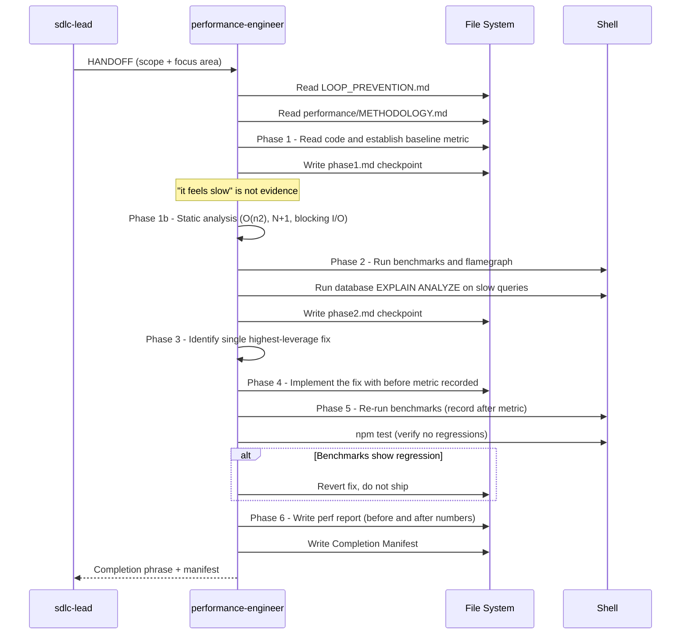

[🏠 Book](../README.md)  |  [📖 Chapter](README.md)  |  [← Code Reviewer](05-code-reviewer.md)  |  [Architecture Designer →](07-architecture-designer.md)

---

# 5.6 Performance Engineer

**File:** `agents/performance-engineer.md` | **Skill:** `/perf`

Measure-first profiling discipline. Never recommends an optimization without a measured baseline. Produces findings reports; coding-agent handles remediation in a separate HANDOFF.

## Execution Flow

## Key Rules

- Every finding requires a **before/after measurement** — not an estimate
- Phase 3 identifies **one fix** (highest leverage), not all findings
- This agent produces a report; coding-agent applies the fix in a separate HANDOFF when in bounded mode
- Cross-references existing CODE_REVIEW doc to avoid re-raising the same findings

## Deliverables

- Phase checkpoint files under `docs/work/performance-engineer/slug/`
- Performance report with before/after benchmark numbers, file:line for each finding, concrete fix with expected delta
- Inputs to `docs/reviews/FIX_BACKLOG_feature_date.md`

---

[🏠 Book](../README.md)  |  [📖 Chapter](README.md)  |  [← Code Reviewer](05-code-reviewer.md)  |  [Architecture Designer →](07-architecture-designer.md)
