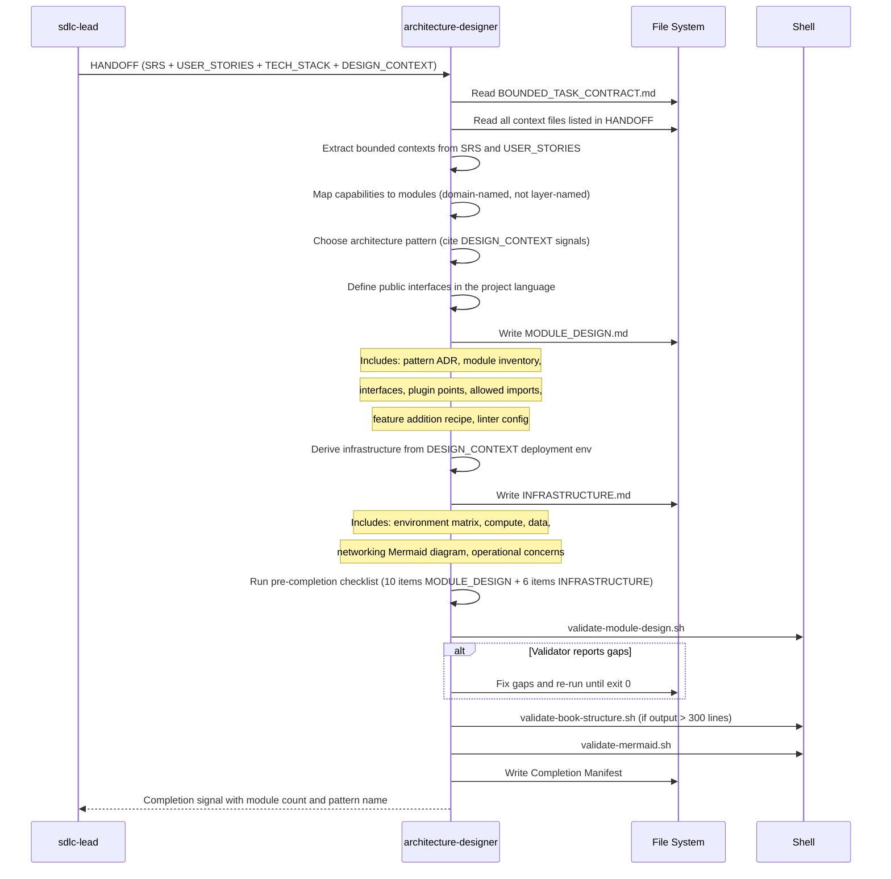

[🏠 Book](../README.md)  |  [📖 Chapter](README.md)  |  [← Performance Engineer](06-performance-engineer.md)  |  [Test Engineer →](08-test-engineer.md)

---

# 5.7 Architecture Designer

**File:** `agents/architecture-designer.md` | **Skill:** `/architect`

Produces the structural blueprint — module design and infrastructure topology — from SDLC documents. Does not write application code, schemas, or API contracts; defines the structure that other specialists fill in.

## Execution Flow

## Pattern Selection

| Signal from DESIGN_CONTEXT | Pattern chosen |
|----------------------------|---------------|
| External integrations dominant | Ports and Adapters |
| Complex business rules | Domain-Driven Design |
| Large independent frontend | Frontend-Backend separation |
| Event-heavy or async | Event-Driven |
| Simple CRUD, small team | Layered monolith |
| Mixed concerns | Modular monolith |

## Deliverables

- `docs/MODULE_DESIGN.md` — pattern + ADR, module inventory, interface contracts, plugin points, dependency rules, linter enforcement config
- `docs/INFRASTRUCTURE.md` — environment matrix, compute, data layer, networking diagram (Mermaid), operational concerns

---

[🏠 Book](../README.md)  |  [📖 Chapter](README.md)  |  [← Performance Engineer](06-performance-engineer.md)  |  [Test Engineer →](08-test-engineer.md)
