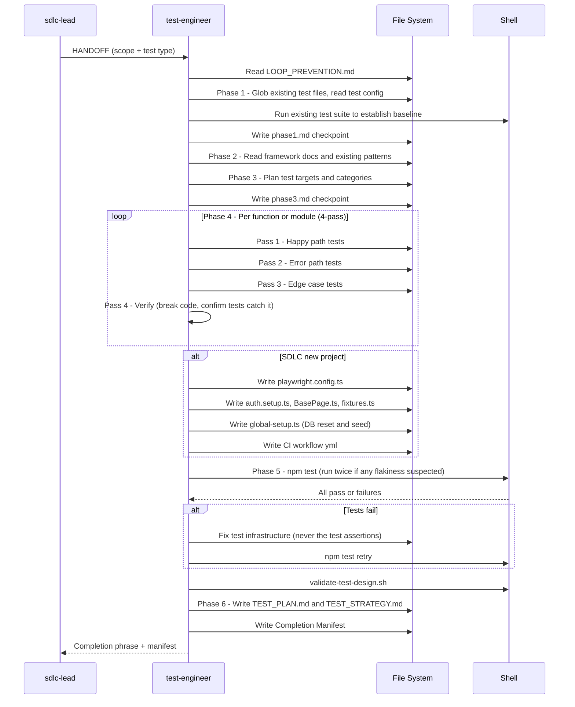

[🏠 Book](../README.md)  |  [📖 Chapter](README.md)  |  [← Architecture Designer](07-architecture-designer.md)  |  [Database Architect →](09-db-architect.md)

---

# 5.8 Test Engineer

**File:** `agents/test-engineer.md` | **Skill:** `/test-expert`

Designs and writes unit, integration, and E2E tests focused on catching real bugs in critical paths — not chasing coverage numbers. Produces full Playwright infrastructure when invoked for a new SDLC project.

## Execution Flow

## Test Pyramid

| Layer | Framework | Focus |
|-------|-----------|-------|
| Unit | vitest or jest | Pure functions, business logic |
| Integration | vitest + supertest | Service boundaries, DB interactions |
| E2E | Playwright | Full user flows, acceptance criteria |

## Deliverables

| File | When |
|------|------|
| Test spec files | Always |
| `playwright.config.ts` | New SDLC project |
| `e2e/auth.setup.ts` | New SDLC project |
| `e2e/pages/BasePage.ts` | New SDLC project |
| `e2e/fixtures.ts` | New SDLC project |
| CI workflow yml | New SDLC project |
| `docs/testing/TEST_PLAN.md` | Always |
| `docs/TEST_STRATEGY.md` | Full audit mode |

---

[🏠 Book](../README.md)  |  [📖 Chapter](README.md)  |  [← Architecture Designer](07-architecture-designer.md)  |  [Database Architect →](09-db-architect.md)
