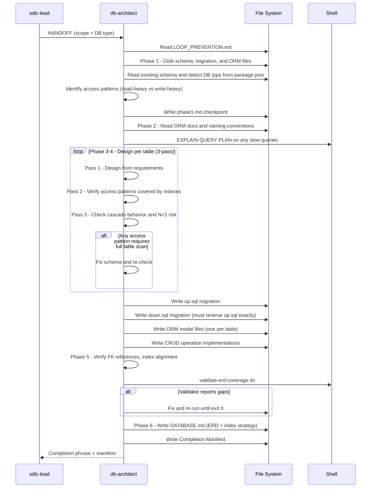

[🏠 Book](../README.md)  |  [📖 Chapter](README.md)  |  [← Test Engineer](08-test-engineer.md)  |  [API Designer →](10-api-designer.md)

---

# 5.9 Database Architect

**File:** `agents/db-architect.md` | **Skill:** `/dba`

Designs schemas, writes migrations, optimizes queries, and models ORM entities. Always begins by identifying access patterns and scale considerations before writing any SQL.

## Execution Flow

## Schema Design Rules

- 3NF minimum — denormalize only with explicit performance justification
- Every migration has a paired `down.sql` that fully reverses `up.sql`
- Indexes derived from access patterns, not guessed
- N+1 patterns flagged at design time via ORM model review

## Deliverables

- `up.sql` + `down.sql` migration files (sequentially numbered)
- ORM model files (one per table)
- CRUD operation implementations
- `docs/DATABASE.md` — Mermaid ERD, query patterns, index strategy, migration convention, security notes

---

[🏠 Book](../README.md)  |  [📖 Chapter](README.md)  |  [← Test Engineer](08-test-engineer.md)  |  [API Designer →](10-api-designer.md)
