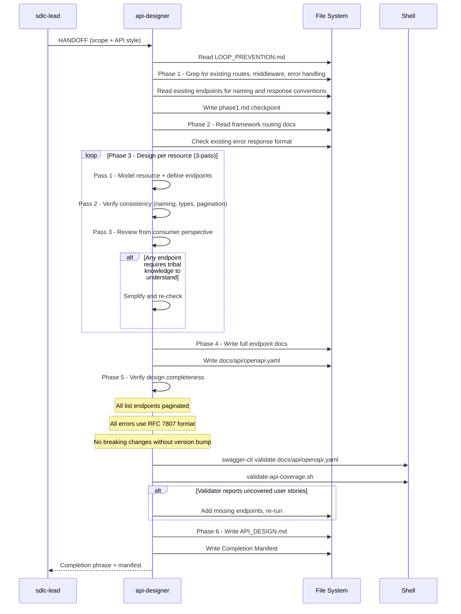

[🏠 Book](../README.md)  |  [📖 Chapter](README.md)  |  [← Database Architect](09-db-architect.md)  |  [Researcher →](11-researcher.md)

---

# 5.10 API Designer

**File:** `agents/api-designer.md` | **Skill:** `/api-design`

Designs REST/GraphQL contracts from a developer-experience perspective. Produces versioning strategy, naming conventions, and a machine-readable OpenAPI spec. Design and documentation only — no implementation.

## Execution Flow

## Versioning Decision

| Change type | Action |
|-------------|--------|
| New optional field, new endpoint, new enum value | No version bump needed |
| Remove or rename field, change type, change auth | New URL version + migration guide |

## Deliverables

- `docs/API_DESIGN.md` — versioning policy, naming conventions, error format, pagination approach
- `docs/api/openapi.yaml` — full OpenAPI 3.0.3 spec with all paths, schemas, security schemes

---

[🏠 Book](../README.md)  |  [📖 Chapter](README.md)  |  [← Database Architect](09-db-architect.md)  |  [Researcher →](11-researcher.md)
