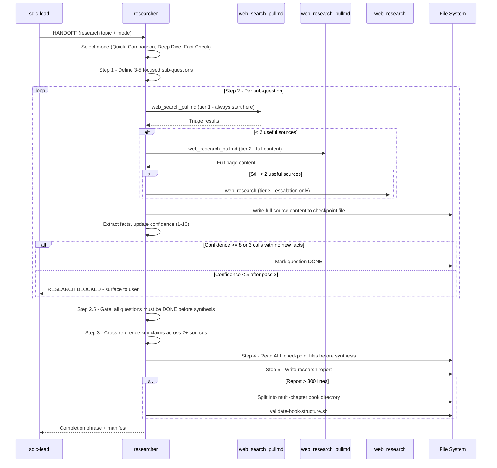

[🏠 Book](../README.md)  |  [📖 Chapter](README.md)  |  [← API Designer](10-api-designer.md)  |  [UX Engineer →](12-ux-engineer.md)

---

# 5.11 Researcher

**File:** `agents/researcher.md` | **Skill:** `/research`

Professional research analyst. Investigates and synthesizes findings with citations using a tiered tool escalation strategy. Strictly scoped to research — redirects any code, schema, or audit request to the appropriate specialist.

## Execution Flow

## Research Modes

| Mode | Passes | Output |
|------|--------|--------|
| Quick Lookup | 1, 1-3 sources | Brief answer with citations |
| Comparison | Per criterion | Comparison table |
| Deep Dive | Up to 4 per question | Full report with exec summary |
| Fact Check | 1-2, 2-4 sources | CONFIRMED / CONTRADICTED / UNVERIFIABLE verdict |

## Tool Escalation Tiers

| Tier | Tool | When |
|------|------|------|
| 1 | `web_search_pullmd` | Always start here |
| 2 | `web_research_pullmd` | Fewer than 2 useful tier-1 results |
| 3 | `web_research` | Fewer than 2 useful tier-2 results |
| 4 | `web_fetch` | Known specific URL |

3-strikes rule: if 3 consecutive calls return no results or the same error → emit RESEARCH BLOCKED and stop.

## Deliverables

- `docs/research/RESEARCH_topic_date.md` — exec summary, per-question findings, sources with credibility ratings, confidence level, limitations
- `docs/work/research/YYYY-MM-DD/question-slug.md` — per-question checkpoints (written after every tool call)
- Multi-chapter book directory if report exceeds 300 lines

---

[🏠 Book](../README.md)  |  [📖 Chapter](README.md)  |  [← API Designer](10-api-designer.md)  |  [UX Engineer →](12-ux-engineer.md)
