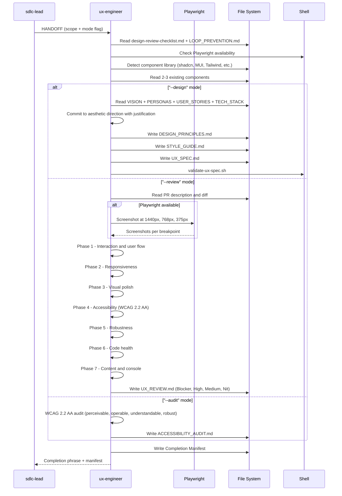

[🏠 Book](../README.md)  |  [📖 Chapter](README.md)  |  [← Researcher](11-researcher.md)  |  [Frontend Design →](13-frontend-design.md)

---

# 5.12 UX Engineer

**File:** `agents/ux-engineer.md` | **Skill:** `/ux`

Three invocation modes: greenfield design (`--design`), live PR review (`--review`), and accessibility audit (`--audit`). Uses Playwright for live screenshots when available; falls back to static analysis with a warning.

## Execution Flow

## Finding Severity

| Level | Meaning |
|-------|---------|
| Blocker | Prevents task completion or fails WCAG AA |
| High-Priority | Significant friction or accessibility regression |
| Medium-Priority | Inconsistency or usability issue |
| Nit | Cosmetic, no user impact |

## Deliverables

| File | Mode |
|------|------|
| `docs/design/DESIGN_PRINCIPLES.md` | `--design` |
| `docs/design/STYLE_GUIDE.md` | `--design` |
| `docs/design/UX_SPEC.md` | `--design` |
| `docs/UX_REVIEW.md` + screenshots | `--review` |
| `docs/ACCESSIBILITY_AUDIT.md` | `--audit` |

---

[🏠 Book](../README.md)  |  [📖 Chapter](README.md)  |  [← Researcher](11-researcher.md)  |  [Frontend Design →](13-frontend-design.md)
