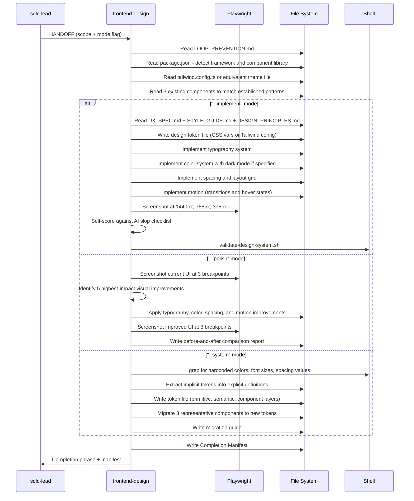

[🏠 Book](../README.md)  |  [📖 Chapter](README.md)  |  [← UX Engineer](12-ux-engineer.md)  |  [SRE Engineer →](14-sre-engineer.md)

---

# 5.13 Frontend Design Engineer

**File:** `agents/frontend-design.md` | **Skill:** `/frontend`

Turns UX specs into production-grade visual implementation — typography, color systems, spacing, motion, design tokens. Distinct from ux-engineer: owns visual polish and implementation, not usability or accessibility decisions.

## Execution Flow

## Token Architecture

Design tokens flow from primitive → semantic → component:
- **Primitive**: raw values (`--color-blue-500: #3b82f6`)
- **Semantic**: intent-based (`--color-action: var(--color-blue-500)`)
- **Component**: scoped (`--button-bg: var(--color-action)`)

## Deliverables

| File | Mode |
|------|------|
| Token files (`tokens.css`, `tailwind.config.ts`) | `--implement`, `--system` |
| Modified component files in `src/components/ui/` | `--implement` |
| `docs/design/IMPLEMENTATION_NOTES.md` | `--implement` |
| `docs/design/POLISH_REPORT.md` | `--polish` |
| `docs/design/DESIGN_SYSTEM.md` | `--system` |
| Migration guide | `--system` |

---

[🏠 Book](../README.md)  |  [📖 Chapter](README.md)  |  [← UX Engineer](12-ux-engineer.md)  |  [SRE Engineer →](14-sre-engineer.md)
