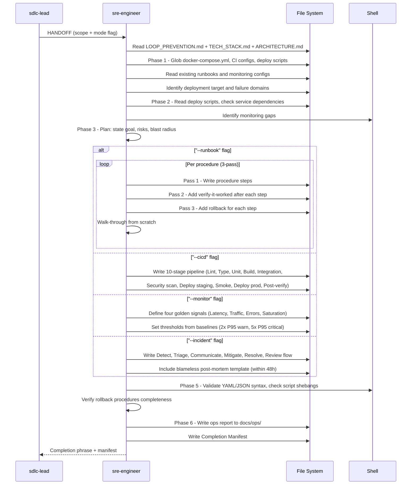

[🏠 Book](../README.md)  |  [📖 Chapter](README.md)  |  [← Frontend Design](13-frontend-design.md)  |  [Container Ops →](15-container-ops.md)

---

# 5.14 SRE Engineer

**File:** `agents/sre-engineer.md` | **Skill:** `/devops`

Produces runbooks, CI/CD pipelines, monitoring configurations, and incident response procedures. Scoped to deploy and operate concerns — Dockerfile and image work belongs to container-ops.

## Execution Flow

## Runbook Quality Gate (3-pass per procedure)

Each runbook procedure must have three passes before it is accepted:
1. **Steps** — what to do
2. **Verify** — how to confirm each step worked
3. **Rollback** — how to undo each step

Any step requiring unstated knowledge → add context, restart loop.

## Deliverables

| File | Mode |
|------|------|
| Runbook markdown in `docs/ops/` | `--runbook` |
| CI/CD YAML pipeline | `--cicd` |
| Monitoring + alert config | `--monitor` |
| Incident response procedure + post-mortem template | `--incident` |

---

[🏠 Book](../README.md)  |  [📖 Chapter](README.md)  |  [← Frontend Design](13-frontend-design.md)  |  [Container Ops →](15-container-ops.md)
