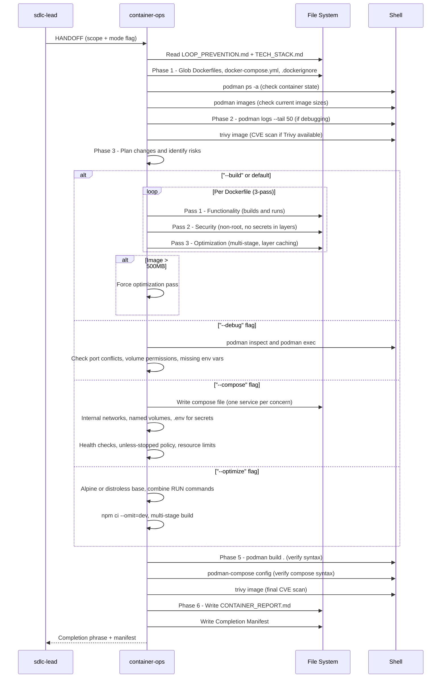

[🏠 Book](../README.md)  |  [📖 Chapter](README.md)  |  [← SRE Engineer](14-sre-engineer.md)  |  [Git Expert →](16-git-expert.md)

---

# 5.15 Container Ops

**File:** `agents/container-ops.md` | **Skill:** `/containers`

Builds, debugs, and optimizes container images and compose configurations for Podman and Docker. Scoped to image and container concerns — deploy pipelines belong to sre-engineer.

## Execution Flow

## Dockerfile Quality Gate (3-pass)

| Pass | Focus |
|------|-------|
| 1 — Functionality | Does it build and run? |
| 2 — Security | Non-root user, no secrets in layers, minimal base |
| 3 — Optimization | Multi-stage, layer caching, minimal final image size |

Image size gate: any typical web app image over 500MB triggers a mandatory optimization pass.

## Deliverables

- `Dockerfile` (new or updated, multi-stage)
- `docker-compose.yml` or `podman-compose.yml`
- `.dockerignore`
- `docs/ops/CONTAINER_REPORT.md` — before/after image sizes, service architecture, security concerns

---

[🏠 Book](../README.md)  |  [📖 Chapter](README.md)  |  [← SRE Engineer](14-sre-engineer.md)  |  [Git Expert →](16-git-expert.md)
