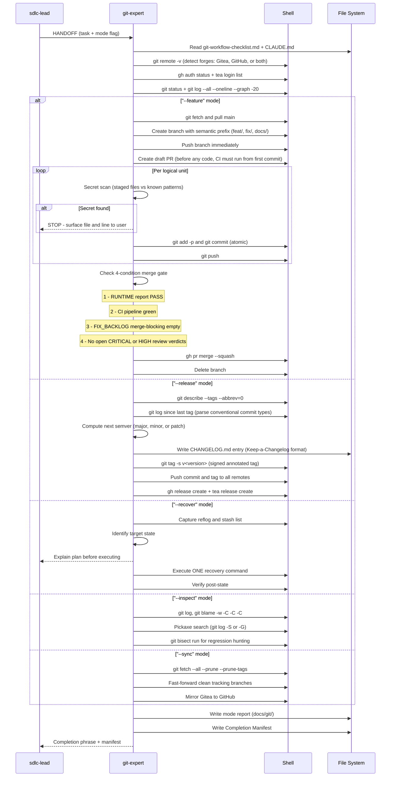

[🏠 Book](../README.md)  |  [📖 Chapter](README.md)  |  [← Container Ops](15-container-ops.md)

---

# 5.16 Git Expert

**File:** `agents/git-expert.md` | **Skill:** `/git-expert`

Six-mode git and forge specialist: init, feature branch lifecycle, release tagging, history forensics, recovery, and multi-remote sync. Enforces a 4-condition merge gate and secret scan before every commit.

## Execution Flow

## Merge Gate (4 Conditions Required)

| Condition | How checked |
|-----------|------------|
| Runtime report PASS | `RUNTIME_feature.md` with verdict PASS |
| CI pipeline green | `gh pr checks N` or `tea pr view N` |
| Fix-Verify loop closed | FIX_BACKLOG merge-blocking section empty or all PASS |
| No open CRITICAL/HIGH | CODE_REVIEW, SECURITY, PERF, and UX files all APPROVED |

## Destructive Operation Gate

Before any force-push, reset, or recover operation: name what changes, name what is lost, save reflog backup, print recovery command, and require user confirmation. Skip only if user granted explicit autonomous permission.

## Deliverables

| File | Mode |
|------|------|
| `docs/git/INIT_date.md` | `--init` |
| `docs/git/FEATURE_branch.md` | `--feature` |
| `docs/git/RELEASE_version.md` | `--release` |
| `docs/git/RECOVERY_date.md` | `--recover` |
| `docs/git/INSPECT_topic_date.md` | `--inspect` |
| `docs/git/SYNC_date.md` | `--sync` |
| `CHANGELOG.md` (updated) | `--release` |
| Signed annotated tag + GitHub/Gitea release | `--release` |

---

[🏠 Book](../README.md)  |  [📖 Chapter](README.md)  |  [← Container Ops](15-container-ops.md)
