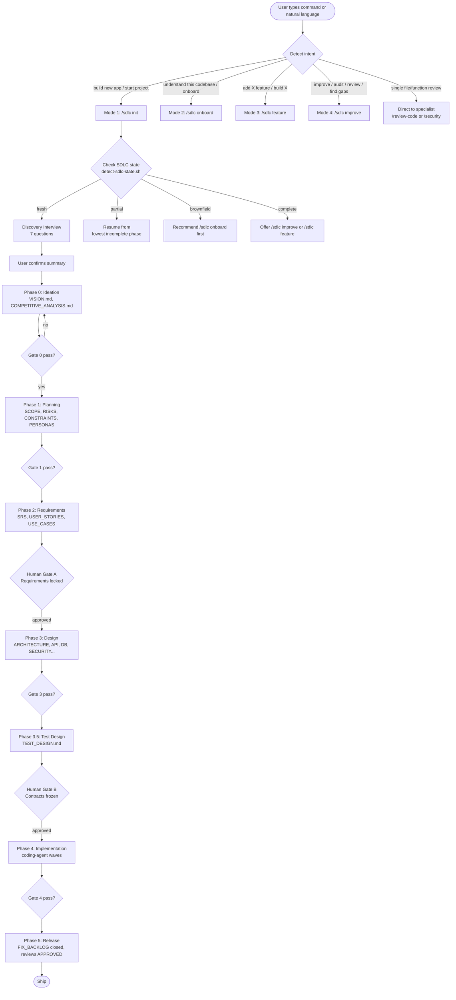
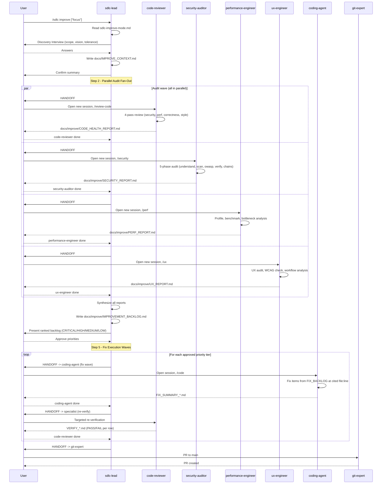

[🏠 Index](README.md)  |  [← Agent System](05-agents/README.md)  |  [HANDOFF Delegation Protocol →](07-handoff-protocol.md)

---

# 6. SDLC Workflow

The SDLC Lead orchestrates four distinct modes based on user intent.

### 6.1 Mode Routing

### 6.2 Mode 4 (Audit and Improve) Sequence

---

---

[🏠 Index](README.md)  |  [← Agent System](05-agents/README.md)  |  [HANDOFF Delegation Protocol →](07-handoff-protocol.md)
