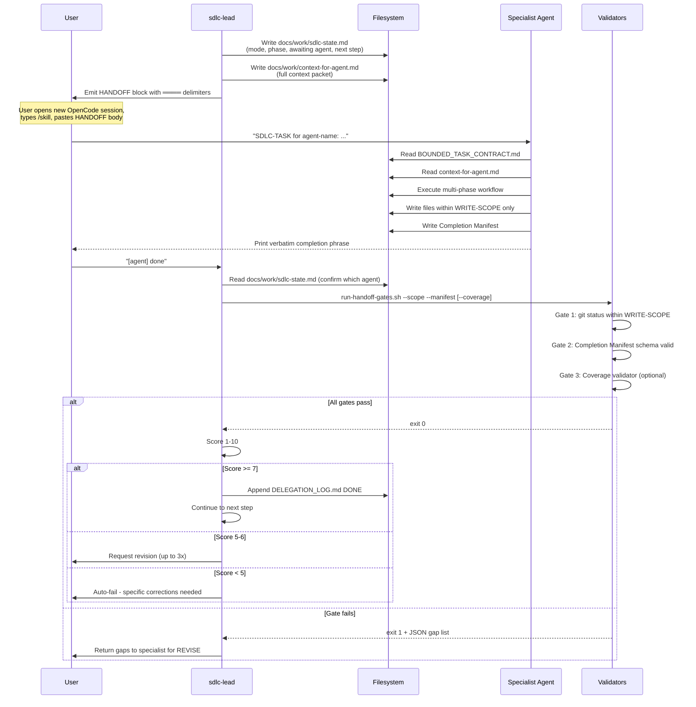
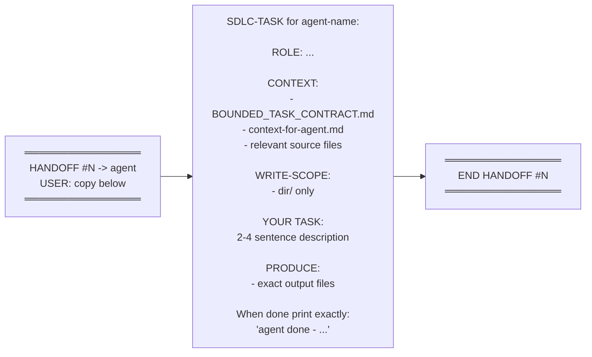

[🏠 Index](README.md)  |  [← SDLC Workflow](06-sdlc-workflow.md)  |  [Validation Gate System →](08-validators.md)

---

# 7. HANDOFF Delegation Protocol

Since `task()` does not work in OpenCode, all agent delegation uses explicit HANDOFF blocks.

### 7.1 HANDOFF Lifecycle

### 7.2 HANDOFF Block Format

---

---

[🏠 Index](README.md)  |  [← SDLC Workflow](06-sdlc-workflow.md)  |  [Validation Gate System →](08-validators.md)
