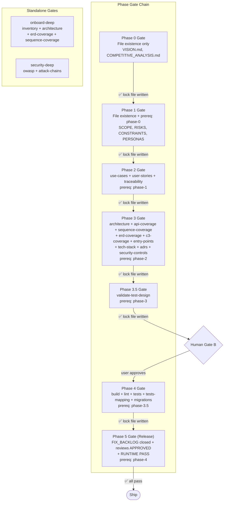
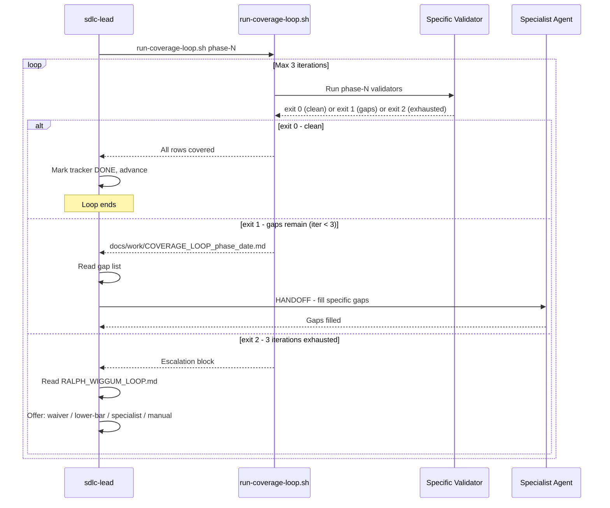

[🏠 Index](README.md)  |  [← HANDOFF Delegation Protocol](07-handoff-protocol.md)  |  [Installation Flow →](09-installation.md)

---

# 8. Validation Gate System

### 8.1 Phase Gate Structure



### 8.2 Coverage Loop Protocol



### 8.3 New Validators (added 2026-06-01)

Two new validators were added during the system review session and are wired into the phase gate chain.

#### validate-mermaid.sh

Static Mermaid syntax checker. Scans all `.md` files (or a target directory) for 6 error classes before a diagram renderer ever touches them:

| Code | Pattern | Example bad input |
|------|---------|-------------------|
| M001 | Unquoted `/` in `[node label]` | `SDLC[/sdlc]` |
| M002 | Semicolons in `Note over` text | `Note over A: step one; step two` |
| M003 | Unicode `→` arrows | `A → B` |
| M004 | Unquoted `\|` in node label context | `node[\|label]` |
| M005 | Empty `[]` or `()` node labels | `A[]` |
| M006 | Unclosed mermaid fenced blocks | ` ```mermaid` with no closing ` ``` ` |

Wired into **phase-3** and **onboard-deep** gates (after `validate-no-ascii-art.sh`).

```bash
bash scripts/validators/validate-mermaid.sh .           # scan entire repo
bash scripts/validators/validate-mermaid.sh . docs/     # scan docs/ only
```

#### validate-book-structure.sh

Validates that a `docs/<slug>/` directory is a well-formed book per `BOOK_PROTOCOL.md`. Supports **2-level nesting** — flat chapter files and chapter directories with sub-chapter files.

**Book level checks:**
- `README.md` exists with a navigation table (pipe-delimited with links)
- At least 2 chapter entries (files or directories) present

**Flat chapter file checks:**
- Has `[🏠 Index]` nav bar at top and bottom
- Does not exceed 400 lines

**Chapter directory checks (sub-chapter level):**
- `README.md` present with navigation table linking to sub-pages
- At least 1 sub-chapter file (`01-*.md`, `02-*.md`, …)
- Each sub-chapter has two-breadcrumb nav bar: `[🏠 Book](../README.md) | [📖 Chapter](README.md)`
- Each sub-chapter does not exceed 400 lines
- Warns (not errors) on any 3rd-level directory nesting

```bash
bash scripts/validators/validate-book-structure.sh docs/review/
# stdout: {"ok":true,"errors":0,"warnings":0,"chapters":14,"chapter_dirs":0,...}
# stderr: validate-book-structure: PASS — .../docs/review (14 chapters, 0 with sub-pages)
```

Exits 0 (pass), 1 (structural errors), 2 (usage error). Outputs JSON findings to stdout and human summary to stderr.

---

---

[🏠 Index](README.md)  |  [← HANDOFF Delegation Protocol](07-handoff-protocol.md)  |  [Installation Flow →](09-installation.md)
