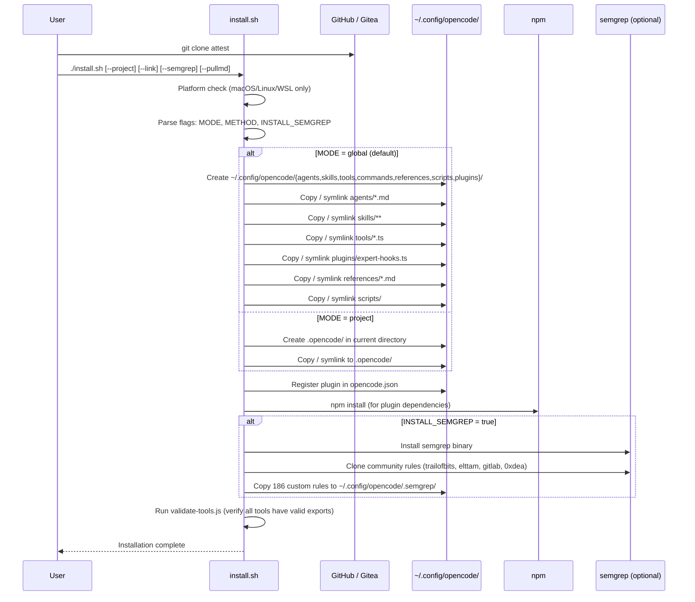

[🏠 Index](README.md)  |  [← Validation Gate System](08-validators.md)  |  [Code Health Findings →](10-code-health.md)

---

# 9. Installation Flow

---

---

[🏠 Index](README.md)  |  [← Validation Gate System](08-validators.md)  |  [Code Health Findings →](10-code-health.md)
