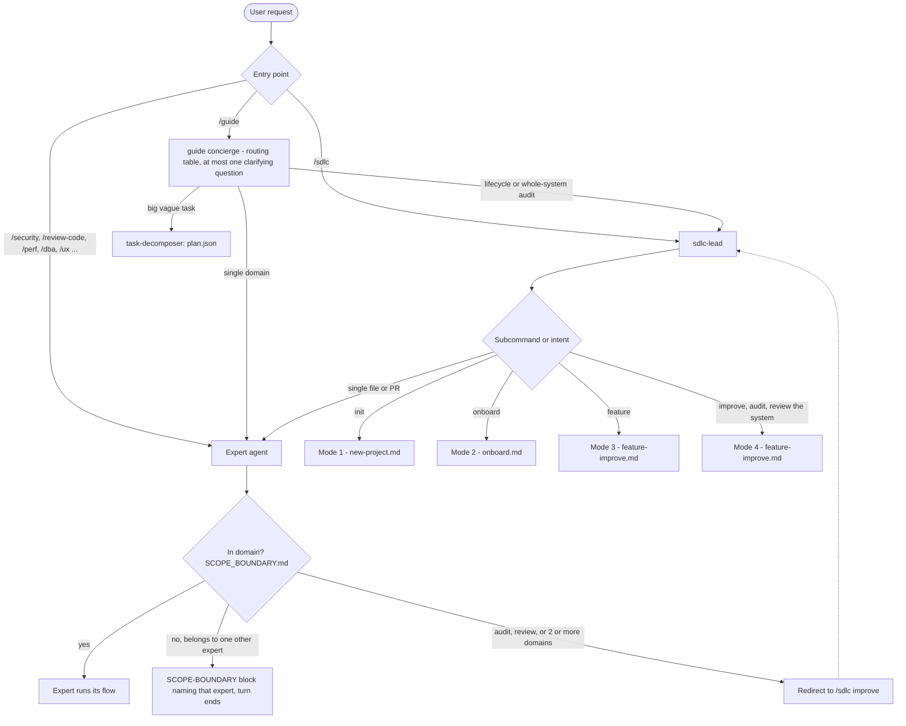
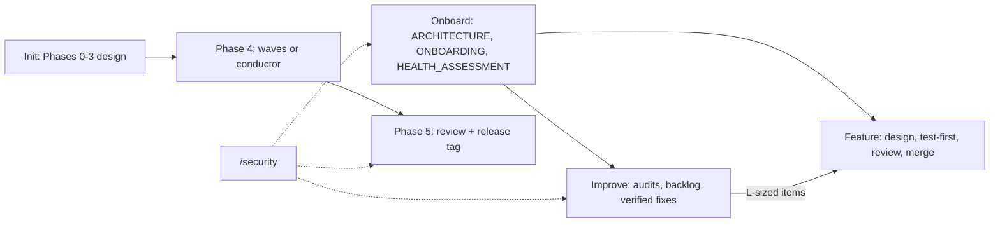

# Process Flows

_Diagrams of how attest's agents actually run, each checked against the agent sources on 2026-09-23._

| Flow | Command | Page |
|------|---------|------|
| How a request is routed | `/guide`, `/sdlc`, `/<expert>` | this page |
| New project, Phases 0–5 | `/sdlc init` | [new-project.md](new-project.md) |
| **Onboarding an existing codebase** | `/sdlc onboard [--quick\|--deep]` | [onboard.md](onboard.md) |
| Add a feature | `/sdlc feature` | [feature-improve.md](feature-improve.md) |
| Audit and improve | `/sdlc improve` | [feature-improve.md](feature-improve.md) |
| **Security audit and fix** | `/security [--quick\|--deep\|--fix]` | [security.md](security.md) |
| Code health and performance | `/review-code`, `/perf` | [review-perf.md](review-perf.md) |
| Unattended Phase 4 | `scripts/conductor/conductor.mjs` | [unattended.md](unattended.md) |
| HANDOFFs, gates, Ralph Wiggum loop, challenger | (all of the above) | [protocols.md](protocols.md) |

Each page ends with a **Known gaps** or **Known inconsistencies** section. These are places where the agent sources contradict one another, or where a validator can't be satisfied by the flow that runs it. They're listed so the diagrams stay honest until those gaps are fixed in the sources.

## How a request reaches a flow

Routing sources: `agents/guide.md`, the mode table in `agents/sdlc-lead.md`, `agents/shared/PHASE_ROUTING_PROTOCOL.md` and `agents/shared/SCOPE_BOUNDARY.md`. A HANDOFF (`SDLC-TASK for ...`) skips the scope check, because the bounded-task contract takes precedence (see [protocols.md](protocols.md)).

## How the modes connect

Onboarding is usually the first step on an existing codebase. Its ARCHITECTURE.md, PATTERNS.md and HEALTH_ASSESSMENT.md are what Mode 3 and Mode 4 read instead of re-exploring the code. If Mode 4 runs without those documents, it writes a lighter `SYSTEM_SNAPSHOT.md` instead.
