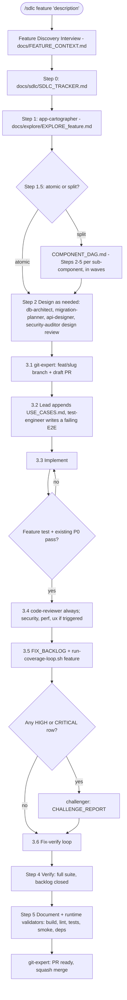
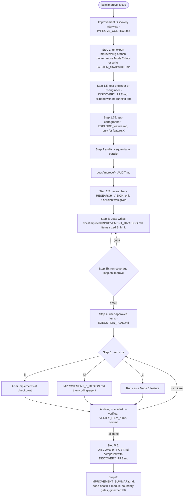

# Feature and Improve Flows — `/sdlc feature`, `/sdlc improve`

_Mode 3 adds a feature to an existing codebase. Mode 4 audits one and works a prioritized improvement backlog._

Source of truth: `agents/sdlc-feature-mode.md`, `agents/sdlc-improve-mode.md`, `commands/sdlc-feature.md`, `commands/sdlc-improve.md`.

## Mode 3 — Feature addition

The test is written first and must **fail** before implementation begins, then pass after it. Reviewers are added by trigger: security for auth/input/secrets, perf for queries and hot paths, ux for UI files.

## Mode 4 — Improve

**Step 2 audits.** There are five core audits, each writing `docs/improve/<X>_AUDIT.md`:

- ux-engineer
- code-reviewer
- performance-engineer
- security-auditor
- db-architect

These specialists are added on demand: a11y-compliance, data-steward, reliability-engineer, cost-engineer and analytics-architect. Every approved item is verified by the specialist who found it, not the one who fixed it.
