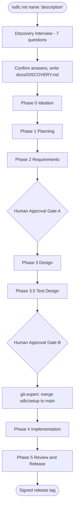
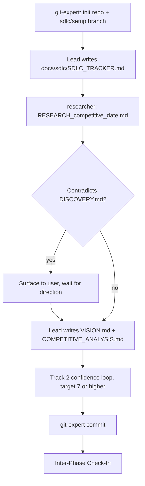
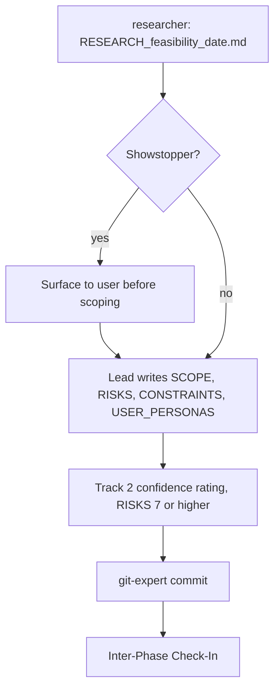
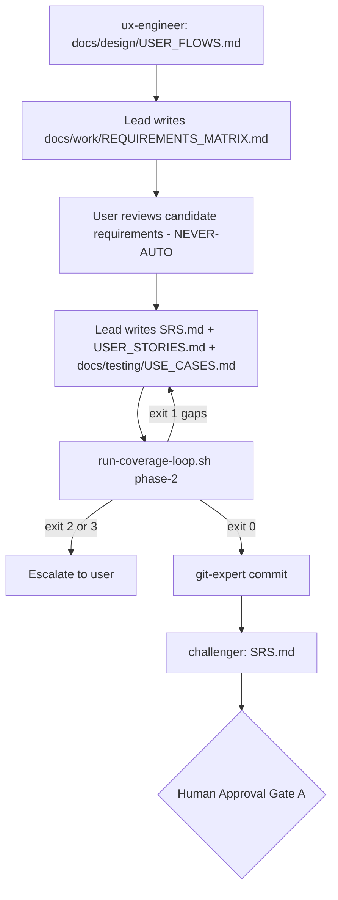
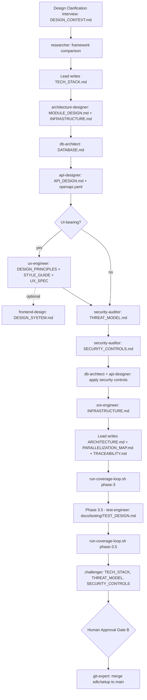
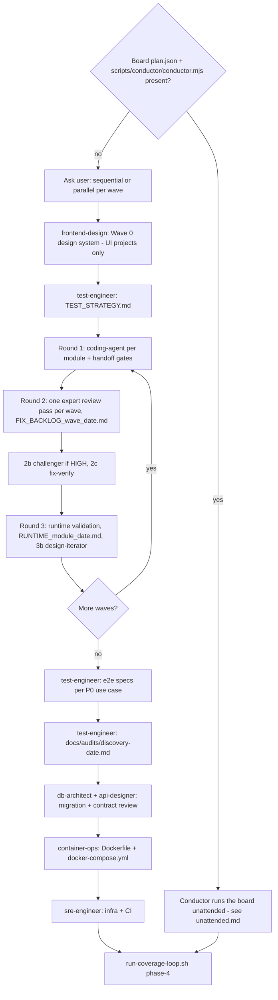
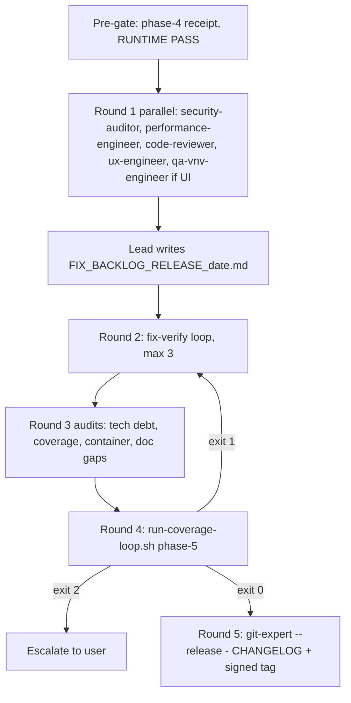

# New Project Flow — `/sdlc init`

_Mode 1: from a one-line idea to a signed release tag._

Source of truth: `agents/sdlc-init-mode.md` (routing), `agents/sdlc-init-phases-0-2.md`, `agents/sdlc-init-phase-3.md` (Phase 3 and 3.5), `agents/sdlc-init-phase-4.md`, `agents/sdlc-init-phase-5.md`. `agents/sdlc-init-phases-3-4.md` is a legacy file that `sdlc-init-mode.md` does not load.

## Lifecycle overview

The Discovery Interview is NEVER-AUTO: planning stays interactive even in `autonomy: auto`. Each phase ends with an inter-phase check-in and a git-expert commit on `sdlc/setup`.

## Phase 0 — Ideation

## Phase 1 — Planning

## Phase 2 — Requirements

## Phase 3 — Design, then 3.5 Test Design

"Phase 3.5" is **Test Design**. A separate design chain (ux-researcher → design-system-lead → content-designer) exists as agents, but sdlc-lead doesn't dispatch it. It is reached only through an `--auto` note inside the ux-engineer HANDOFF, for when `docs/design/flows.md` or `tokens.json` is missing, and no gate checks it.

## Phase 4 — Implementation

Wave rules (scope collisions, when parallel is refused) are in `agents/sdlc/PARALLEL_WAVE_PROTOCOL.md`.

## Phase 5 — Review and Release

Phase 5 tags and publishes a release. It does not deploy.

## Paths every phase agrees on

- Use cases: `docs/testing/USE_CASES.md`. Validators and state detection still accept a legacy `docs/USE_CASES.md`, preferring the canonical path.
- Test design: `docs/testing/TEST_DESIGN.md` (Phase 3.5), which Phase 4 updates with each P0's test file and result. `TEST_PLAN.md` belongs to onboarding.
- Gate fact-checks: Gate A challenges `docs/SRS.md`. Gate B challenges `docs/TECH_STACK.md`, `docs/THREAT_MODEL.md` and `docs/SECURITY_CONTROLS.md`.
