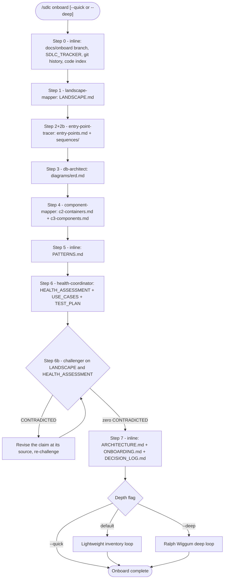
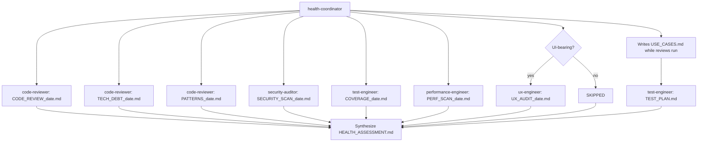
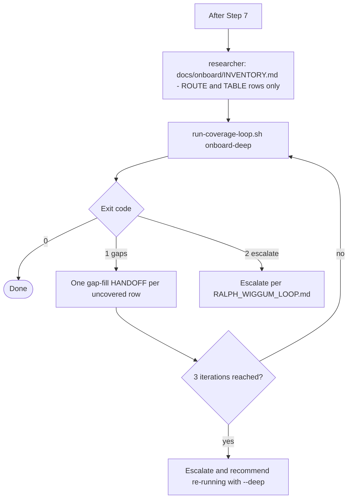
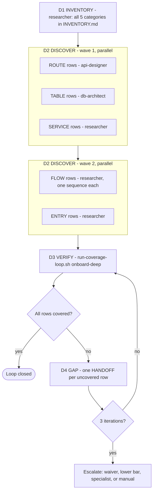

# Onboarding Flow — `/sdlc onboard`

_Mode 2: reverse-engineer an existing codebase into architecture, diagrams, a health assessment and an onboarding guide._

Source of truth: `agents/sdlc-onboard-mode.md` (coordinator), `agents/sdlc/onboard/*.md` (specialists), `commands/sdlc-onboard.md`.

## Depth levels

| Flag | Runs | Time | Use when |
|------|------|------|----------|
| `--quick` | Steps 0–7 | ~15–20 min | Exploratory orientation — no inventory verification |
| (default) | Steps 0–7 + lightweight inventory (ROUTE, TABLE) | ~30–40 min | Standard onboard; catches undocumented routes and tables |
| `--deep` | Steps 0–7 + full Ralph Wiggum loop (ROUTE, TABLE, SERVICE, FLOW, ENTRY) | ~45–90 min | Contract bids, due diligence, security-sensitive takeovers |

## Overall flow

Every specialist step is a HANDOFF (see [protocols.md](protocols.md)). After each return the coordinator checks the file exists with real content and flips the tracker row to `DONE`. If `docs/sdlc/SDLC_TRACKER.md` already exists, the run resumes from the first row that isn't `DONE`.

## Step-by-step detail

| Step | Who | Reads | Produces |
|------|-----|-------|----------|
| 0 | Coordinator + `git-expert --inspect` | git log, repo | branch `docs/onboard`, `docs/sdlc/SDLC_TRACKER.md`, `docs/git/HISTORY_INSPECTION_<date>.md`, `code_index()` if the code-search MCP is present |
| 1 | `landscape-mapper` | history inspection, README, CLAUDE.md | `docs/LANDSCAPE.md` (stack, metrics, structure, hot files, recent focus, UI detection) |
| 2+2b | `entry-point-tracer` | LANDSCAPE.md | `docs/diagrams/entry-points.md`, `docs/diagrams/sequences/{auth,write-operation,read-operation,async-flows,error-flows}.md` |
| 3 | `db-architect` (`/dba`) | schemas, models, migrations | `docs/diagrams/erd.md` (Mermaid `erDiagram`) |
| 4 | `component-mapper` | LANDSCAPE.md, entry-points.md | `docs/diagrams/c2-containers.md`, `docs/diagrams/c3-components.md` |
| 5 | Coordinator | source | `docs/PATTERNS.md` (error handling, state, data access, testing, naming) |
| 6 | `health-coordinator` | LANDSCAPE.md, entry-points.md | `docs/HEALTH_ASSESSMENT.md`, `docs/testing/USE_CASES.md`, `docs/testing/TEST_PLAN.md` |
| 6b | `challenger` ×2 | LANDSCAPE.md, HEALTH_ASSESSMENT.md | `docs/reviews/CHALLENGE_REPORT_{landscape,health}_<date>.md` |
| 7 | Coordinator | everything above | `docs/ARCHITECTURE.md` (C1, C2, C3, ≥3 sequences, data flow, deployment), `docs/ONBOARDING.md`, `docs/DECISION_LOG.md` |

## Step 6 — health assessment fan-out

`health-coordinator` is itself an orchestrator. Running it inline does **not** mean doing its reviews inline — each review is still a HANDOFF to the owning expert.

All review outputs land in `docs/reviews/`. HEALTH_ASSESSMENT.md carries a 1–10 score per dimension, a severity table, the top 3 issues with file:line, and a fix priority order.

## Lightweight inventory (default mode)

## Deep mode — Ralph Wiggum loop

The `onboard-deep` gate chains `validate-inventory.sh`, `validate-architecture.sh`, `validate-erd-coverage.sh`, `validate-sequence-coverage.sh`, `validate-no-ascii-art.sh`, `validate-mermaid.sh` and `validate-doc-render-health.sh`. Always call it through `run-coverage-loop.sh`: that wrapper counts iterations and enforces the cap, while the bare gate does not.

Sub-skills run individual deep steps: `/onboard-inventory` (D1), `/onboard-verify` (D3), `/onboard-gap-fill` (D4).

## Known gaps (as of 2026-09-23)

These are behavior mismatches in the agents and validators, recorded here and not yet fixed:

1. **Default mode can't close on most repos.** The lightweight inventory writes only ROUTE and TABLE rows. The gate it runs, `validate-inventory.sh`, re-derives SERVICE rows from the top-level `src/` subdirectories (and similar source roots) and reports `inventory-missing-service` for each one it doesn't find. On any project with source subdirectories, default mode spends its 3 iterations and then recommends `--deep`.
2. **Onboard sequence diagrams aren't counted by the gate.** Step 2b writes `docs/diagrams/sequences/*.md`. `validate-sequence-coverage.sh` only accepts `docs/sequences/<UC-id>*.md`, or a UC-headed `sequenceDiagram` in ARCHITECTURE.md. Step 7 has to embed the sequences in ARCHITECTURE.md under UC-id headings for them to count.
3. **The three parallel code-reviewer HANDOFFs share one file.** In Step 6, health-coordinator writes HANDOFFs 1–3 to the same `docs/work/HANDOFF_code-reviewer.md`. When they're dispatched in parallel through a paste-based executor, each write overwrites the one before it.
