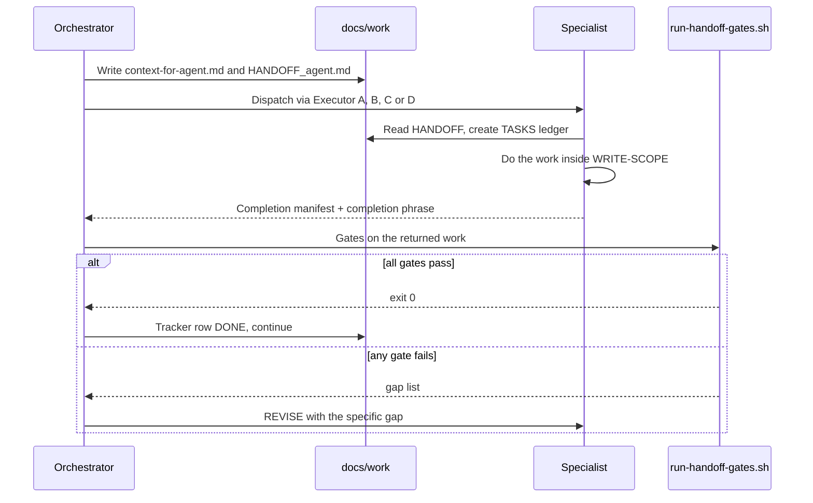
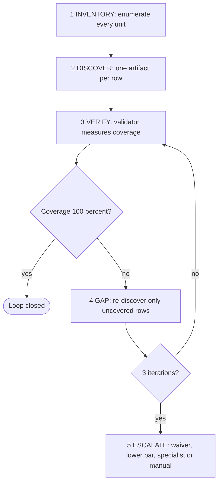

# Cross-Cutting Protocols

_The rules every diagram in this book assumes: how work is handed off, returned, gated and looped._

## Two protocols every agent honors

1. **Scope boundary** (`agents/shared/SCOPE_BOUNDARY.md`). When a primary agent is invoked directly (the user typed `/research` or `/code`), it first checks whether the request belongs to its domain. If it doesn't, the agent prints a SCOPE-BOUNDARY block naming the right specialist, or `/sdlc` for orchestration, and stops. Requests like "review for gaps", "audit this" or "evaluate" always go to Mode 4 (`/sdlc improve`). The agent never handles them freelance.
2. **Bounded task contract** (`agents/shared/BOUNDED_TASK_CONTRACT.md`). When a prompt starts with `SDLC-TASK for <agent>:`, or names a `docs/work/HANDOFF_*.md` file, five rules apply: writes stay inside the write-scope, nothing is produced beyond the PRODUCE list, the completion phrase is returned verbatim, scope never expands, and "stop" means stop. Inside a HANDOFF the scope check is skipped, because the contract takes precedence.

## HANDOFF lifecycle



**Executor selection** (`agents/shared/EXECUTOR_SELECTION.md`). The orchestrator picks one of four executors:

| Executor | How it runs the specialist | Notes |
|----------|---------------------------|-------|
| A | Parallel subagents | Used when a task tool exists |
| B | `opencode run` subprocess | Available whenever `opencode_cli` is |
| C | The user pastes the HANDOFF into the specialist's `/skill` | Only works for specialists that have a skill |
| D | The orchestrator runs it inline | The last resort, and never used for the security specialists |

In `autonomy: auto`, Executor C falls back to D, because nobody is there to paste.

## Context packet

Before every HANDOFF, the orchestrator writes `docs/work/context-for-{agent}.md` with these sections:

- the project, in three sentences
- the task
- files to read, in priority order
- files to produce
- patterns to follow
- what not to do

The HANDOFF points at this file instead of inlining it. A specialist that has to re-explore the codebase on its own spends 30–50% of its context on orientation.

## Completion manifest

Every specialist ends with:

```
# Completion: {agent} — {task summary}
Files produced: [list with line counts]
Files modified: [list with what changed]
Tests: [new count, existing pass/fail, test command]
Decisions: [key choices, with reasoning]
Known issues: [deferred items, with why]
Ready for: {next agent or "SDLC lead resume"}
```

## Post-HANDOFF gates

`scripts/validators/run-handoff-gates.sh` runs the gates below in order. Any failure aborts the rest and returns a REVISE.

| Gate | Checks |
|------|--------|
| 1 Scope | `validate-scope.sh`: git writes stay inside the assigned directories, `docs/work/**` and `docs/reviews/**` |
| 2 Manifest | `validate-completion-manifest.sh`: the schema is valid, the claimed files exist, verify cites a real artifact, and maker ≠ verifier |
| 2b | Tech-stack law check. With `--review`, it also checks reviewer citations |
| 3 Coverage | An optional domain validator, passed as `--coverage` (see below) |
| 4 Tracker | Tracker-worthy work changed a tracker file, measured against the branch point |
| 5 Runtime | Only with `--runtime` (coding-agent HANDOFFs): build + lint + file size on the files this HANDOFF changed |

| HANDOFF type | `--coverage` |
|--------------|--------------|
| api-designer | `validate-api-coverage.sh` |
| db-architect | `validate-erd-coverage.sh` |
| architecture synthesis | `validate-architecture.sh` |
| security-auditor --deep | `validate-owasp.sh` |
| onboard --deep | `validate-inventory.sh` |
| code / refactor | omit |

## Phase gates — two tracks

- **Track 1, coverage loop.** `scripts/validators/run-coverage-loop.sh <phase>` wraps `validate-phase-gate.sh <phase>`, counts iterations, stops after 3, and halts at once (exit 3) when a round changes nothing. Always call the wrapper. The bare gate has no counter.
- **Track 2, confidence loop.** Phases 0 and 1 produce prose (vision, scope, risks). Nothing there can be counted mechanically, so the lead rates its own confidence and loops until the rating is ≥ 7.

Gate modes: `phase-2`, `phase-3`, `phase-3.5`, `phase-4`, `phase-5`, `onboard-deep`, `security-deep`, `feature`, `improve`. A clean gate writes a receipt to `docs/work/gates/<phase>-receipt.json`, which records what ran and hashes the phase's files.

## Ralph Wiggum loop (deep verification)

Canonical protocol: `agents/shared/RALPH_WIGGUM_LOOP.md`. Used by `/sdlc onboard --deep` ([onboard.md](onboard.md)) and `/security --deep` ([security.md](security.md)).



The loop replaces the specialist's own confidence score with a measured coverage percentage.

## Challenger gate

Any artifact dense with factual claims gets an adversarial `challenger` pass before it's accepted: onboard's LANDSCAPE and HEALTH_ASSESSMENT, security's final-report, and any FIX_BACKLOG with HIGH/CRITICAL rows. The pass must come back with zero CONTRADICTED verdicts. Reports go to `docs/reviews/CHALLENGE_REPORT_<topic>_<date>.md`.
