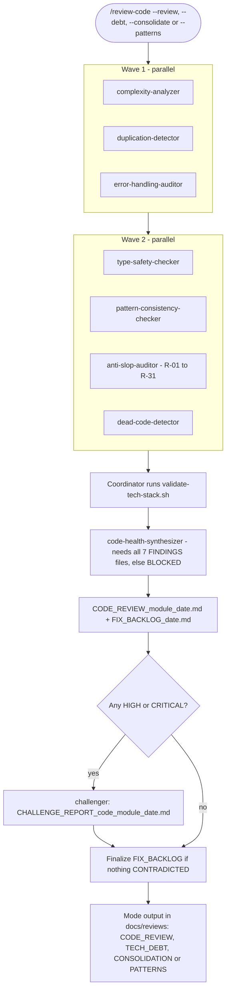
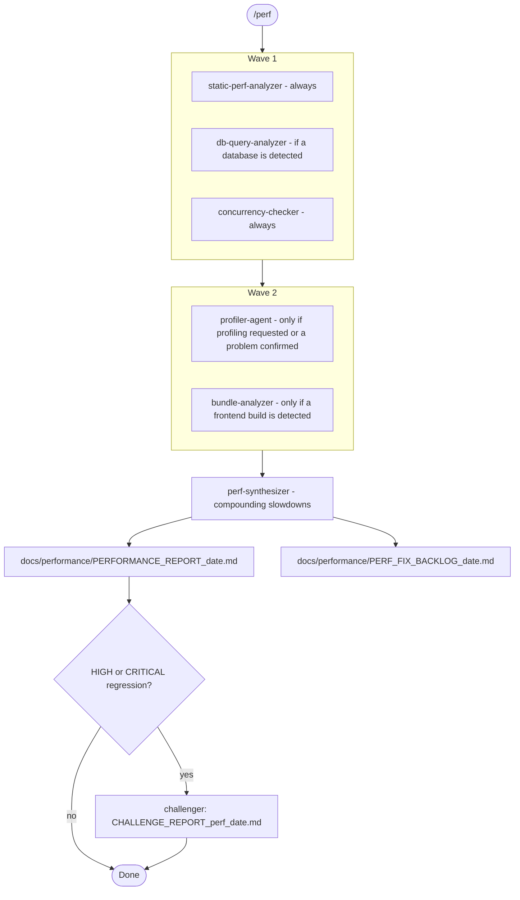

# Code-Health and Performance Flows — `/review-code`, `/perf`

Source of truth: `agents/code-reviewer.md` + `agents/code-review/*.md`; `agents/performance-engineer.md` + `agents/performance/*.md`.

## `/review-code`

The mode flag changes only the final document; every mode runs the same specialists. Each specialist writes `<NAME>_FINDINGS_<date>.md`. The synthesizer looks for **compounding risk**, where one module is complex, duplicated *and* handles errors badly. `/review-code` never applies fixes itself; they go to FIX_BACKLOG.

## `/perf`

The rule is to measure before optimizing. A slow query inside an O(n²) loop with no caching is scored as multiplicative, not additive.
