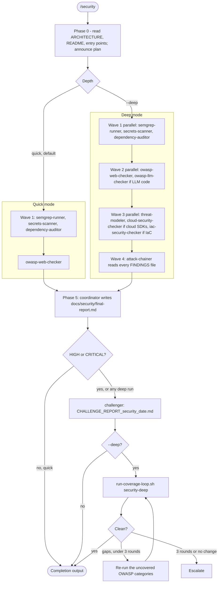
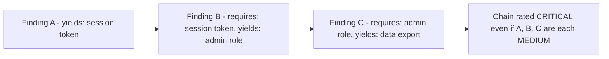
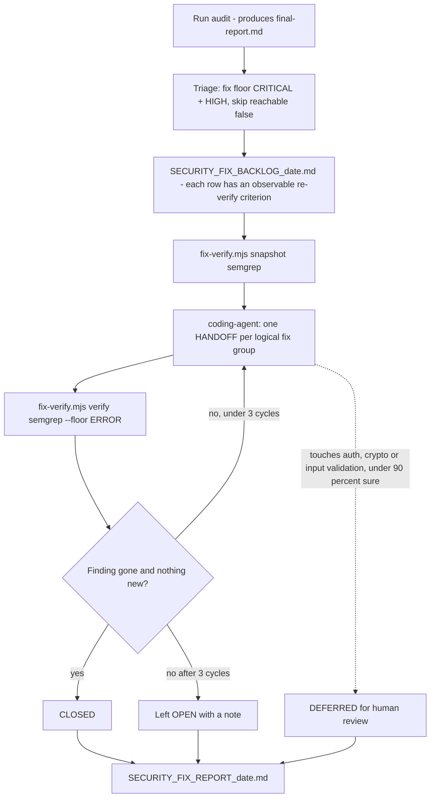
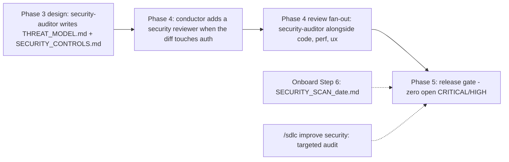

# Security Flow — `/security`

_How a security audit runs: specialist waves, the attack chainer, the challenger gate, and the verified fix loop._

Source of truth: `agents/security-auditor.md` (coordinator), `agents/security/*.md` (specialists), `skills/security/SKILL.md`, `agents/shared/RALPH_WIGGUM_LOOP.md`, `agents/shared/FIX_VERIFY_LOOP.md`.

## Modes

| Invocation | What runs | Time |
|------------|-----------|------|
| `/security` or `/security --quick` | Wave 1 + OWASP Web; challenger if any HIGH/CRITICAL | ~10 min |
| `/security --deep` | All four waves, then `run-coverage-loop.sh security-deep` until every OWASP category is covered (max 3 iterations) | ~45–90 min |
| `/security --fix` | The audit (quick unless combined with `--deep`), then the verified fix loop | audit + fixes |
| `/security --deep --fix` | Exhaustive find-and-fix | longest |

## Full audit — specialist waves

Specialists are always dispatched in fresh context. That's Executor A (subagents, parallel within a wave) when a task tool exists, and Executor B (`opencode run` subprocesses, run one after another) when it doesn't. The coordinator never runs a specialist inline: scan output is the largest tool output in the system and would flood the session.

## Who produces what

| Wave | Specialist | Runs when | Output in `docs/security/` |
|------|------------|-----------|----------------------------|
| 1 | `semgrep-runner` (Opengrep + bpm-rulepacks) | always | `SEMGREP_FINDINGS_<date>.md` |
| 1 | `secrets-scanner` | always | `SECRETS_FINDINGS_<date>.md` |
| 1 | `dependency-auditor` | always | `DEPENDENCY_FINDINGS_<date>.md` |
| 2 | `owasp-web-checker` | always | `OWASP_WEB_FINDINGS_<date>.md`, `OWASP_TRACKER.md` |
| 2 | `owasp-llm-checker` | LLM code detected | `LLM_FINDINGS_<date>.md` |
| 3 | `threat-modeler` | deep | `THREAT_MODEL_FINDINGS_<date>.md`, `docs/design/THREAT_MODEL.md` |
| 3 | `cloud-security-checker` | cloud SDKs detected | `CLOUD_FINDINGS_<date>.md` |
| 3 | `iac-security-checker` | Terraform/CDK/Pulumi/CFN detected | `IaC_FINDINGS_<date>.md` |
| 4 | `attack-chainer` | deep, last | `ATTACK_CHAINS_<date>.md` |
| 5 | coordinator | always | `final-report.md` |
| gate | `challenger` | HIGH/CRITICAL found | `docs/reviews/CHALLENGE_REPORT_security_<date>.md` |

Every finding uses `agents/security/FINDING_SCHEMA.md`, which records **preconditions** and **yields**. The attack chainer links one finding's yield to another finding's precondition to build multi-step exploit paths. A chain is rated above the severity of any single finding in it.

## How attack chaining works

Findings the chainer marks `reachable: false` (dead code) are reported but skipped by the fix loop unless you ask for them.

## Fix mode — verified remediation loop

A fix is closed only when the re-scan shows it's gone. A diff that looks right doesn't count, and a fix that introduces a new finding isn't a fix.

## Where security runs in the lifecycle

Design-time threat models must explicitly assess three bootstrap and authority archetypes listed in `security-auditor.md`, each either mitigated or ruled N/A with a reason: **bootstrap-authority** (no safe way to create the first privileged user), **self-referential permission gate** (a role only that role can grant), and **RBAC highest-role-wins** (N roles per principal, but enforcement picks one role instead of the union of grants).

## Known gaps (as of 2026-09-23)

These are mismatches between the skill and the coordinator, recorded here and not yet fixed:

1. **`--deep` exists only in the skill.** `skills/security/SKILL.md` and `RALPH_WIGGUM_LOOP.md` define deep mode and its `security-deep` coverage loop. `agents/security-auditor.md` has a Quick Mode section and a Fix Mode section but no Deep Mode section, and it never says which flag selects the full four-wave run. The deep row in the diagram above is the intended behavior, assembled from the skill.
2. **The focused flags aren't implemented.** The skill lists `--threat-model`, `--owasp` and `--deps`. The coordinator doesn't mention any of them.
3. **Legacy output name.** `agents/security/OWASP_METHODOLOGY.md` Phase 5b still writes `docs/security/attack-chains.md`. The coordinator and `attack-chainer` write `ATTACK_CHAINS_<date>.md`.
