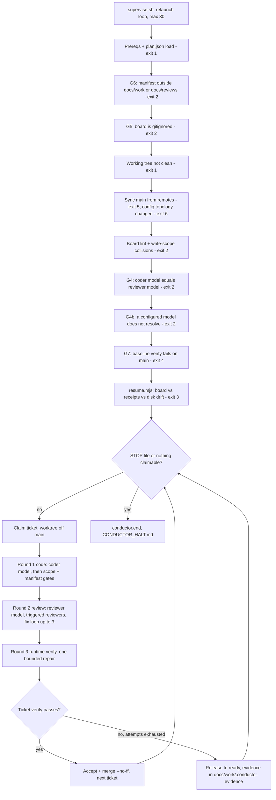

# Unattended Phase 4 — the conductor

_How `scripts/conductor/conductor.mjs` works a `plan.json` board without a human in the loop._

Source of truth: `scripts/conductor/conductor.mjs`, `scripts/conductor/supervise.sh`, `scripts/conductor/resume.mjs`, `scripts/lib/review-triggers.mjs`. The operator guide is [../UNATTENDED_EXECUTION.md](../UNATTENDED_EXECUTION.md).

Planning stays interactive. The board comes from Phases 0–3 and `task-decomposer`; the conductor only executes it.

## Startup gates, then the ticket loop

Every gate before the loop fires before the first model call.

## Which reviewers run

`scripts/lib/review-triggers.mjs` reads the ticket's diff:

| Reviewer | Added when the diff touches |
|----------|-----------------------------|
| code-reviewer | always |
| security-auditor | auth, tokens, secrets, `exec` or `spawn` |
| performance-engineer | SQL, ORM calls, loops |
| ux-engineer | `.tsx`, `.vue` or `.css` files, or `components/`, `pages/` or `views/` paths |

A ticket's own `reviews` list adds reviewers on top of these triggers. The review always runs on a **different model** from the coder: G4 refuses to start otherwise.

## Supervisor and resume

- **`supervise.sh`** stops for good on exits 2–6, because those are deterministic refusals that a retry won't fix. It restarts on any other non-zero exit, waiting 30 seconds between tries, up to 30 times. It never deletes worktrees, so `resume.mjs` can reconcile them.
- **`resume.mjs`** runs at every startup. It checks `plan.json` against the ticket receipts and against git. A mismatch refuses the run with exit 3. A safe orphan (work that finished but was never recorded) is re-verified rather than re-run.
- **`--no-merge`** pushes the branch for PR review and leaves the ticket In Progress.
- **A merge conflict** aborts the merge. The ticket stays `in_review` and its branch is kept.
